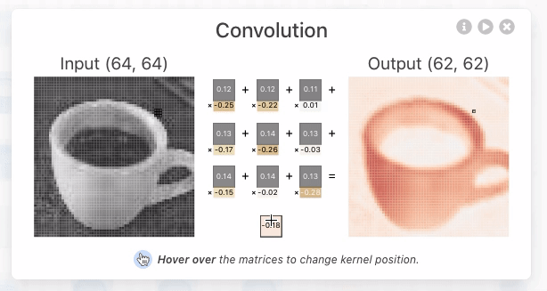
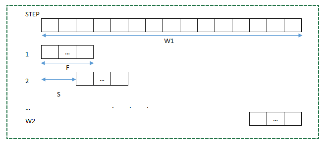
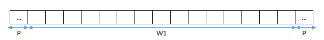
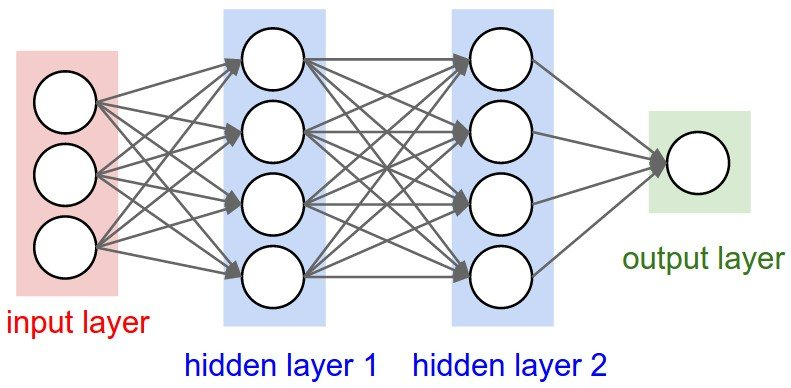
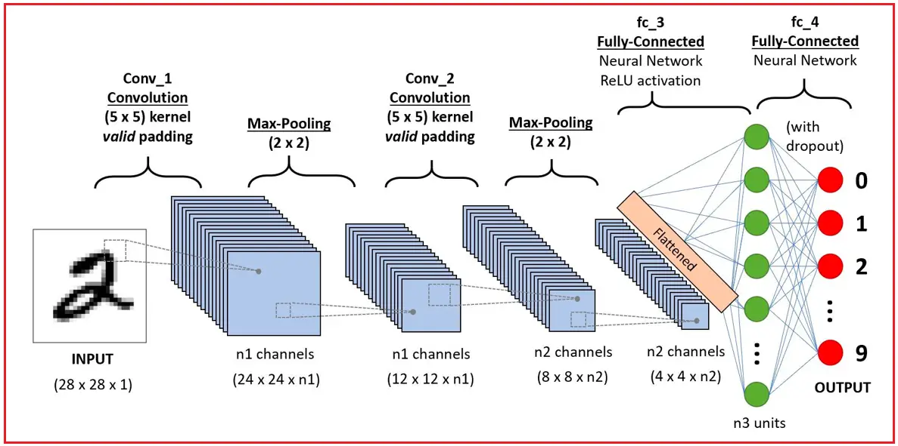
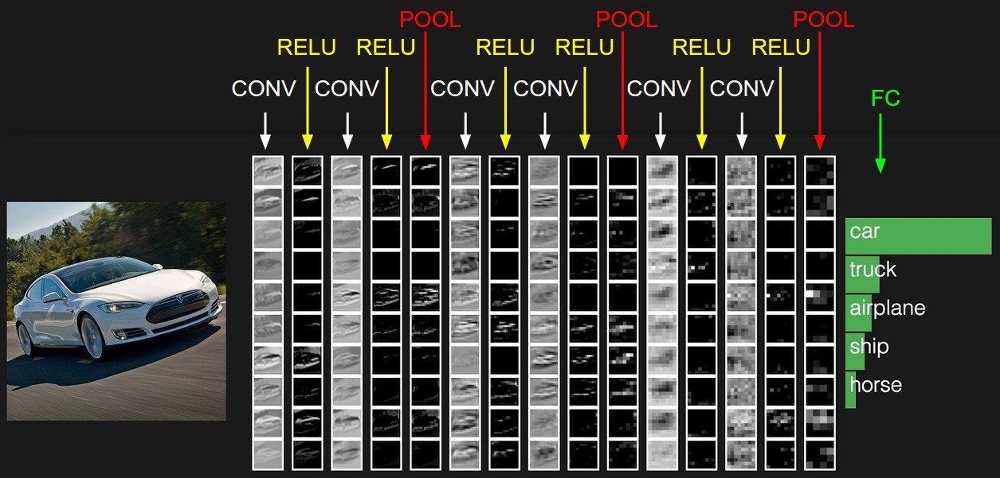
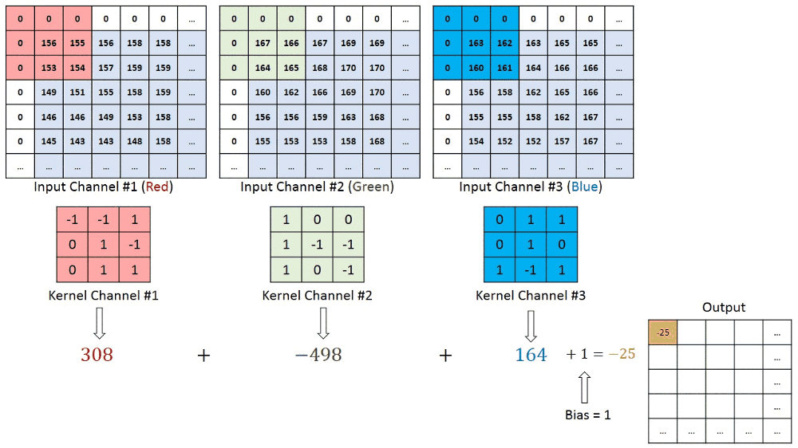

Convolutional Neural Networks are very similar to ordinary Neural Networks, they are made up of neurons that have learnable weights and biases. Each neuron receives some inputs, performs a dot product and optionally follows it with a non-linearity. The whole network still expresses a single differentiable score function: from the raw image pixels on one end to class scores at the other. And they still have a loss function (e.g. SVM/Softmax) on the last (fully-connected) layer and all the tips/tricks we developed for learning regular Neural Networks still apply.

## Convolution

### Definition

Convolution is a concept in digital signal processing that **transforms** the input information through the **convolution operation** with **a filter** to yield an output in a form of a new signal. This signal will **reduces the features** that the filter is not concerned and just **keep the main features**. Each filter have their main purpose. There are many convolution n-dimension, I will talk about the **2D convolution** because it is the easiest to visualize and also the most common convolution.

The two-dimensional convolution applied to the **2D input matrix** and the **2D filter matrix**. The convolution of an input matrix $X \in \mathbb{R}^{W\times H \times d}$ with a filter $F \in \mathbb{R}^{w\times h \times d}$ produces an output matrix $Y \in \mathbb{R}^{W\times H}$. The steps are follows:

* **Compute the convolution at the single point**: Position the filter at the top-left corner of the input matrix, resulting in a submatrix $X_{sub}$ whose size matches the filter's dimension. The first value,  $y_{11}$ is the convolution of $X_{sub}$ with $F$, such as
  $$
y_{11} = \sum_{}^{w}\sum_{}^{h}\sum_{}^{d} x_{sub}[i,j,u] \times f[i,j,u]
$$
* **Slide the window:** Next, slide the filter window across the input matrix from left to right, and then from top to bottom, using the specified stride. For each position, compute the corresponding output value. Once you have traversed the entire input, you obtain the complete output matrix $Y$. ([Click this link to futher more information about this technique](https://usaco.guide/gold/sliding-window?lang=cpp))

<div style="text-align: center;">
	
</div>

In a convolutional neural network (CNN), each subsequent layer takes the output from the layer immediately before it. Therefore, to keep the network design manageable, we need to determine the output size for each layer. This means that given the input (matrix) size $(W_1,H_1)$, a filter of size $(F,F)$, and a stride $S$, we can determine the output matrix $(W_2,H_2)$.
Consider the process sliding with size $1\times W_1$

<div style="text-align: center;">
	
</div>

Assume the process will stop at $W_2$ step. At the first step will reach to position $F$. After each step we will move about $S$, so step $i$ will reach to position $F + (i-1)S$. So that the final step $W_2$ matrix will reach to $F+(W_2-1)S$. This is the highest and closest with $W_1$. In the perfect circumstance the same position $F+(W_2-1)S=W_1$.
$$
W_2=\frac{W_1-F}{S}+1
$$
If there are not in that condition, the division just take the integer, this equation will be
$$
W_2=\lfloor \frac{W_1-F}{S}\rfloor +1
$$
However, we can also make it in the perfect circumstance if we add extra padding on the both edge bound with size $P$ so that the division will divisible by $S$

<div style="text-align: center;">
	
</div>

The equation will be
$$
W_2=\frac{W_1-F+2P}{S}+1
$$
similarly with $H$
$$
H_2=\frac{H_1-F+2P}{S}+1
$$

## Practice

We need to set up such as import lib and load images

````py
import numpy as np
import os
import cv2
from Convolution import conv2d
import matplotlib.pyplot as plt

data_path = "data/"

if not os.path.exists(data_path):
    print(f"Error: Path does not exist - {os.path.abspath(data_path)}")

data_list = os.listdir(data_path)
%load_ext autoreload
%autoreload 2
````

Compute the convolution in 2D

````py
def conv2d(X, F, s=1, p=0):
    """
    X: matrix input
    F: filter
    s: step jump
    p: padding
    """
    (W, H) = X.shape
    f = F.shape[0]
    # Output dimensions
    w = (W - f + 2 * p) // s + 1
    h = (H - f + 2 * p) // s + 1
    X_pad = np.pad(X, pad_width=((p,p),(p,p)), mode='constant', constant_values=0)
    # print(w,h)
    Y = np.zeros((w, h))
    for i in range(w):
        for j in range(h):
            x = i * s
            y = j * s
            Y[i][j] = np.sum(X_pad[x:(x+f),y:(y+f)]*F)
    return Y
````

In this example, I will use emboss filter and calculate the convolution on each image

````py
# emboss filter
filter = np.array([[-2,-1,0]
                   ,[-1,1,1]
                   ,[0,1,2]])

for file in data_list:
    img_path = os.path.join(data_path,file)
    img = cv2.imread(img_path)

    #Convert to grey
    img = cv2.cvtColor(img, cv2.COLOR_RGB2GRAY)
    plt.figure(figsize=(8,6))
    plt.subplot(1,2,1)
    plt.imshow(img)
    #Change to np array
    img = np.array(img)
    blur_img = conv2d(img, filter, s = 1, p=5)
    plt.subplot(1,2,2)
    plt.imshow(blur_img)
    plt.show()
````

## Convolution Neural Network

### Definition

In machine learning, a classifier assigns a class label to a data point. For example, an *image classifier* produces a class label (e.g, bird, plane) for what objects exist within an image. A *convolutional neural network*, or CNN for short, is a type of classifier, which excels at solving this problem!
A CNN is a neural network: an algorithm used to recognize patterns in data. Neural Networks in general are composed of a collection of neurons that are organized in layers, each with their own learnable weights and biases. Let’s break down a CNN into its basic building blocks.

1. A **tensor** can be thought of as an n-dimensional matrix. In CNN above, tensors will be 3-dimensional with the exception of the output layer.
1. A **neuron** can be thought of as a function that takes in multiple inputs and yields as a single output. The outputs of neurons  are represented above as the **activation map**.
1. A **layer** are the collection of the neurons in the same operations
1. **Kernel and weights and bias**, while unique to each neuron, are tuned during the training phase, and allow the classifier to adapt to the problem and dataset provided.
1. A CNN conveys a **differentiable score function**, which is represented as a **class score** in the visualization on the output layers.

Before we start, I will talk some terminology in this blog and you can also see in every lessons or blogs

* **Unit**: A unit represents the value of a specific point in the tensor at each layer of a CNN (Convolutional Neural Network).
* **Receptive Field**: This is a region in the input image that a filter (kernel) processes during convolution. It determines which portion of the input image contributes to a particular unit in the next layer.
* **Local Region**: In a broader sense, it can include the receptive field. It refers to a specific region in the tensor at different layers of a CNN.
* **Feature Map**: This is the output matrix obtained after applying convolution operations between a filter and the receptive fields by sliding from left to right and top to bottom.
* **Activation Map**: The output of the feature map after applying an activation function to introduce non-linearity.

## Architecture view

**Regular Neural Nets**: Neural Networks receive an input (a single vector), and transform it through a series *hidden layer*. Each hidden layer is made up of a set of neurons, where each neuron is fully connected to all neurons in the previous layer, and where neurons in a single layer function completely independently and do not share any connections. The last fully-connected layer is called the “output layer” and in classification settings it represents the class scores.

**Regular Neural Nets** don’t scale well to full images. In CIFAR-10, images are only of size $32\times32\times3$ (32 wide, 32 high, 3 color channels), so a single fully-connected neuron in a first hidden layer of a regular Neural Network would have $32\times32\times3 =3072$ weights. This amount still seems manageable, but clearly this fully-connected structure does not scale to larger images. For example, an image of more respectable size, e.g. $200\times200\times3$, would lead to neurons that have $200\times200\times3 = 120000$ weights. Moreover, we would almost certainly want to have several such neurons, so the parameters would add up quickly! Clearly, this full connectivity is wasteful and the huge number of parameters would quickly lead to overfitting.


**3D volumes of neurons**. Convolutional Neural Networks take advantage of the fact that the input consists of images and they constrain the architecture in a more sensible way. In particular, unlike a regular Neural Network, the layers of a ConvNet have neurons arranged in 3 dimensions: **width, height, depth**. (Note that the word *depth* here refers to the third dimension of an activation volume, not to the depth of a full Neural Network, which can refer to the total number of layers in a network). For example, the input images in CIFAR-10 are an input volume of activations, and the volume has dimensions $32\times32\times3$ (width, height, depth respectively). As we will soon see, the neurons in a layer will only be connected to a small region of the layer before it, instead of all of the neurons in a fully-connected manner. Moreover, the final output layer would for CIFAR-10 have dimensions $1\times1\times10$, because by the end of the ConvNet architecture we will reduce the full image into a single vector of class scores, arranged along the depth dimension.


## Layers used to build ConvNets

A simple ConvNet is a sequence of layers, and every layers of a ConvNet transforms one volume of activations to another through a differentiable function. We use three main types of layers to build ConvNet architectures: **Convolutional Layers,Pooling Layer** and **Fully-Connected Layers** (same as the ANN).
We will go into more deeply, but a simple ConvNet for CIFAR-10 classification could have the architecture, INPUT $\rightarrow$ CONV $\rightarrow$ RELU $\rightarrow$ POOL $\rightarrow$ FC

* INPUT \[32x32x3\] will hold the raw pixel values of the image, in this case an image of width 32, height 32, and three color RGB
* CONV layer will compute the output of neurons that are connected to local regions in the input, each computing a dot product between their weights and a small region they are connected to in the input volume. This may result in volume such as \[32x32x12\] if we decided to use 12 filters.
* RELU layer will apply an elementwise activation function, such as the $max(0,x)$ thresholding at zero. This leaves the size of the volume unchanged (\[32x32x12\]).
* POOL layer will perform a downsampling operation along the spatial dimensions (width, height), resulting in volume such as \[16x16x12\].
* FC (i.e. fully-connected) layer will compute the class scores, resulting in volume of size \[1x1x10\], where each of the 10 numbers correspond to a class score, such as among the 10 categories of CIFAR-10. As with ordinary Neural Networks and as the name implies, each neuron in this layer will be connected to all the numbers in the previous volume.
  In this way, ConvNets transform the original image layer by layer from the original pixel values to the final class scores. Note that some layers contain parameters and other don’t. In particular, the CONV/FC layers perform transformations that are a function of not only the activations in the input volume, but also of the parameters (the weights and biases of the neurons). On the other hand, the RELU/POOL layers will implement a fixed function. The parameters in the CONV/FC layers will be trained with gradient descent so that the class scores that the ConvNet computes are consistent with the labels in the training set for each image.
  

## Convolutional Layer

The Conv layer is the core building block of a Convolutional Network that does most of the computational heavy lifting.
**Let’s first discuss what the CONV layer computes without brain/neuron analogies**. The CONV layer's parameters consist of a set of learnable filters. Every filters is a small spatially(along width and height) but extends through the full depthof the input volume.

<div style="text-align: center;">
	
</div>

For example, lets look at the first convolutional layer have $3\times3\times3$ (3 pixels width and height, and 3 color channels), also have padding. During the foward pass, we slide (convolve) each filter across the width and height of the input volume and compute the dot products between entries of filter and the input at any position. As we slide the filter over the width and height of the input volume, we will produce 2-dimensional **activation map** that gives the responses of that filter at every spatial position. Intuitively, the network will learn filters that activate when they see some type of visual features such as an edge of some orientation or a blotch (patch) of some color on the first layer, or eventually entire [honeycomb](https://www.google.com/search?q=honeycomb) on higher layers of the network. Now we will have an entire set of filters in each CONV layer (e.g. 12 filters), and each of them will produce a separated 2-dimensional activation map. We will stack these activation maps along the depth dimension and produce the output volume. Furthermore, every entry in 3D output volume **can also be intepreted an output of a neuron** that look at only a small region in the input and shares the parameters will all neurons to the left and right.

## Reference

1. [CNN Explainer](https://poloclub.github.io/cnn-explainer/)(CNN visualization)
1. [Image Kernels explained visually](https://setosa.io/ev/image-kernels/)(Convolution visualization)
1. [CS231n Convolutional Neural Networks for Visual Recognition](https://cs231n.github.io/convolutional-networks/)
1. [Khoa học dữ liệu](https://phamdinhkhanh.github.io/2019/08/22/convolutional-neural-network.html)
1. [probml.github.io/pml-book/book1.html](https://probml.github.io/pml-book/book1.html)(book)
