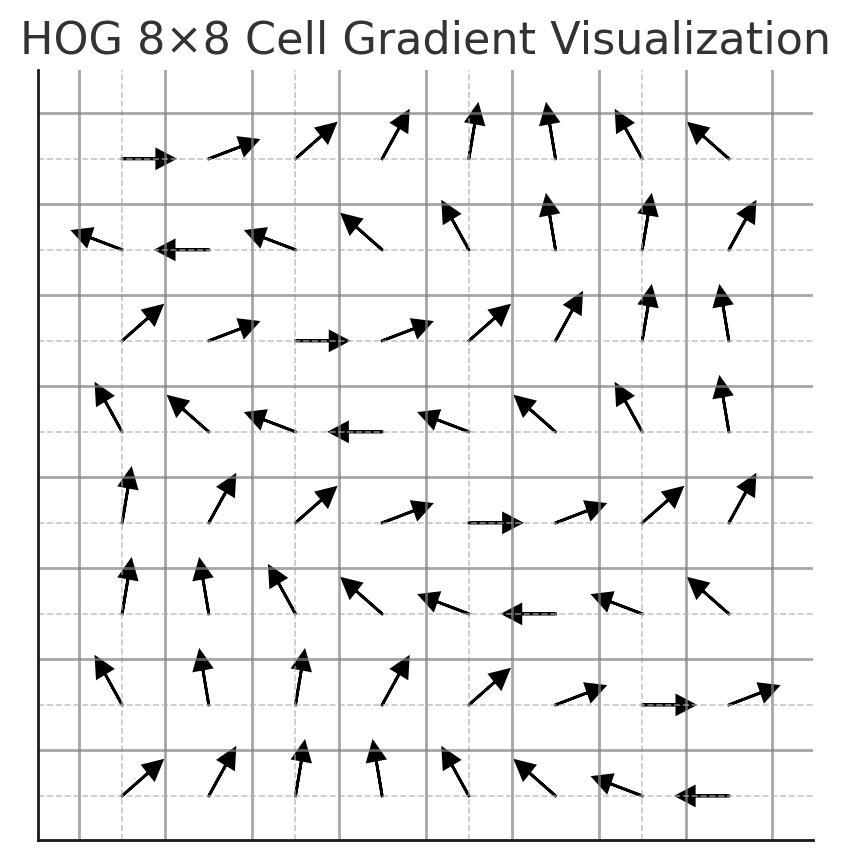

---

There are many different methods in computer vision. When it comes to image classification, we can apply families of CNN models such as Inception Net, MobileNet, ResNet, DenseNet, AlexNet, U-Net, and so on. For object detection, models like YOLO, SSD, Faster R-CNN, Fast R-CNN, and Mask R-CNN are commonly used.
All the above algorithms belong to the deep learning category. However, before the deep learning boom, what algorithms were typically used in image processing? Today, we will explore a classic yet highly effective algorithm in image processing: **HOG (Histogram of Oriented Gradients).**
This algorithm generates **features description** for the purpose of **object detection**. From an image, two key matrices are extracted to store essential information: **gradient magnitude** and **gradient orientation**. By combining these two pieces of information into a histogram distribution—where the gradient magnitude is counted in bins according to gradient orientation—we obtain a **HOG feature vector** that represents the histogram. This is the basic concept, but in practice, the algorithm is more complex. The **HOG vector** is computed over **local regions**, similar to how CNNs operate, followed by **local normalization** to standardize measurements. Finally, the overall **HOG vector** is aggregated from all local vectors.

## HOG Application

There are some applications using HOG and which have high accuracy.

* **Human detection**: This application first represents in [Histogram of Orient Gradients for Human Detection](https://lear.inrialpes.fr/people/triggs/pubs/Dalal-cvpr05.pdf)). HOG can detect one or more people walking on a street in an image.  <div style="text-align: center;">
        
    </div>
    We will practice training model human detection base on HOG.
  
* **Face detection**: HOG is a good algorithm on this problem. It has the ability to represent the main contours of the face based on the direction and gradient magnitude through vectors for each cell as shown bellow <div style="text-align: center;">
   	
   </div>
  
* **Recognizing Various Objects:** In addition, there are many cases of object recognition in static images, such as vehicles, traffic signals, animals, or even moving images extracted from videos.
* **Creating Features for Image Classification Tasks:** Many image classification tasks are built on small-sized datasets, where using deep learning networks may not always be effective and can lead to overfitting. The reason is that a small amount of data is often insufficient for training a model to accurately recognize object features. In such cases, using HOG (Histogram of Oriented Gradients) for feature extraction can yield better results. Specifically, I will also demonstrate an example at the end.

## Terminology

Before diving into the HOG algorithm, I will first explain the terms used:

* **Feature Descriptor:** A feature descriptor is a representation of an image or an image patch that simplifies the image by extracting useful information and throwing away extraneous information.

* **Histogram:** A histogram is a graphical representation of the distribution of color intensities across different value ranges.

* **Gradient:** The derivative or vector of color intensity changes that helps detect movement directions of objects in an image.

* **Local cell:** A local cell is a small region in an image. In the HOG algorithm, an image is divided into multiple cells based on a square grid. Each cell is called a local cell.

* **Local portion:** A local region is a section of the image where feature extraction is performed. In the algorithm, this local region is referred to as a "block."

* **Local normalization:** Normalization is performed within a local region. It is usually divided by either L2 norm or L1 norm. The purpose of normalization is to standardize color intensity values, making the distribution more consistent. This will be explained in more detail in the algorithm section.

* **Gradient direction:** The gradient direction represents the angle between the gradient vector components $x$ and $y$, which helps determine the direction of intensity change or, in other words, the direction of shading in the image. Given that $G_x$​ and $G_y$​ are the gradient values along the $x$ and $y$ axes of the image, the gradient direction is calculated as:
  
  $$\theta = \arctan\left(\frac{G_y}{G_x}\right)$$

* **Gradient magnitude:** The magnitude of the gradient represents the length of the vector combining the gradients along the $x$ and $y$ directions. The histogram representation of this vector is used to describe the HOG features. The gradient magnitude is computed as:
  
  $$∣G∣=\sqrt{G_x^2+G_y^2}$$​

## Definition

The key point in the working principle of HOG is that the local shape of an object can be described using two matrices: the **gradient magnitude matrix** and the **gradient direction matrix**.
First, the image is divided into a **grid of square cells**, where many adjacent or overlapping **local regions** are identified. These regions are similar to the **local image regions** used in convolutional operations in CNNs.
The main purpose of HOG feature extraction is to capture the local shape and edge information of an image. It works by computing the gradients (i.e., the changes in intensity) and then building histograms of these gradients over small, localized regions. This process allows the algorithm to effectively describe the appearance and structure of objects in an image, such as the contours and silhouettes of people.

* A **local region** consists of multiple **local cells** (in HOG, there are **4 cells**) with a size of **8×8 pixels**
* Then, a **histogram of gradient magnitudes** is computed for each **local cell**.
* The **HOG descriptor** is formed by **concatenating** the four histogram vectors corresponding to each cell into a single combined vector.
* To improve accuracy, each value in the **histogram vector of a local region** is **normalized** using either **L2-norm** or **L1-norm**.
* This normalization aims to enhance **invariance** to **lighting and shading changes**.

<div style="text-align: center;">
	
</div>

The HOG descriptor has several key advantages over other feature descriptors:

* Since it operates on **local cells**, it is **invariant** to **geometric transformations** and **brightness changes**.
* Furthermore, as **Dalal and Triggs** discovered, applying **local region normalization** allows the descriptor to ignore minor **body movements** in pedestrian detection, **as long as the person maintains an upright posture**.
* This makes HOG particularly **well-suited for human detection** in images.

## How HOG Works (Step-by-step)

### Preprocessing

In every image processing algorithm, the first step is preprocessing image. As mentioned earlier HOG feature descriptor used for pedestrian detection is calculated on a $64×128$ patch of an image. Of course, an image may be of any size. Typically, patches at multiple scales are analyzed at many image locations. The only constraint is that the patches being analyzed have a fixed aspect ratio. In our case, the patches need to have an aspect ratio of $1:2$. For example, they can be $100×200$, $128×256$, or $1000×2000$ but not $101×205$.

<div style="text-align: center;">
	
</div>

We need to adjust the image to grayscale

````py
import numpy as np
import cv2
import matplotlib.pyplot as plt

#Read the image
img = cv2.imread("./img/bolt.jpg") # Load BGR format

if img is None:
    print("Image not loaded. Check the file path and file integrity.")
else:
    # Convert BGR to RGB for proper color display in matplotlib
    img_rgb = cv2.cvtColor(img, cv2.COLOR_BGR2RGB)

    #Convert to grayscale
    gray = cv2.cvtColor(img, cv2.COLOR_BGR2GRAY)
    print(img_rgb.shape)
    print(gray.shape)

    #Show the images
    plt.figure(figsize=(8,6))
    plt.subplot(1,2,1)
    plt.imshow(img_rgb)
    plt.title("Original")
    plt.subplot(1,2,2)
    plt.imshow(gray)
    plt.title("Gray Image")
    plt.show()
````


### Compute the gradient

To calculate a HOG descriptor, we need to first calculate the horizontal and vertical gradients, the common way to compute is using the **Sobel operator**

* Horizontal gradient
  $$G_x = \begin{bmatrix}
	-1 & 0 & 2 \\
	-2 & 0 & 2 \\ 
	-1 & 0 & 1	
\end{bmatrix}*\textbf{I}$$
* Vertical gradient
  $$G_y = \begin{bmatrix}
		-1 & -2 & -1 \\
		0 & 0 & 0 \\ 
		1 & 2 & 1	
	\end{bmatrix}*\textbf{I}$$
  Where $*$ be a convolution between a filter and an image
* Gradient magnitude
  $$ G=\sqrt{G_x^2+G_y^2}$$
* Gradient direction
  $$\theta=\arctan\Bigl(\frac{G_y}{G_x}\Bigl)$$

````py
#Calculate gradient gx,gy

gx = cv2.Sobel(gray, cv2.CV_32F, dx = 0, dy = 1, ksize=3)

gy = cv2.Sobel(gray, cv2.CV_32F, dx = 1, dy = 0, ksize=3)

  

print('gray shape: {}'.format(gray.shape))

print('gx shape: {}'.format(gx.shape))

print('gy shape: {}'.format(gy.shape))

  

# Compute magnitude and direction gradient

g, theta = cv2.cartToPolar(gx, gy, angleInDegrees=True)

print('gradient format: {}'.format(g.shape))

print('theta format: {}'.format(theta.shape))
````

The output

````
gray shape: (480, 640)
gx shape: (480, 640)
gy shape: (480, 640)
gradient format: (480, 640)
theta format: (480, 640)
````

Visualize the plot

````py
plt.figure(figsize=(20, 10))
plt.subplot(1, 4, 1)
plt.title('gradient of x')
plt.imshow(gx)

plt.subplot(1, 4, 2)
plt.title('gradient of y')
plt.imshow(gy)

plt.subplot(1, 4, 3)
plt.title('Magnitute of gradient')
plt.imshow(g)

plt.subplot(1, 4, 4)
plt.title('Direction of gradient')
plt.imshow(theta)
plt.show()
````


### Calculate Histogram of Gradients in 8 x 8 cells

In this step, the image is divided into $8\times8$ cells and a histogram of gradients is calculated for each $8\times8$. One of the important reasons to use a feature description to describe a patch of an image is that it provided a compact representation. An $8\times8$ patch contain $8\times8\times3=192$ pixels. The gradient of this patch contains $2$ values (magnitude and direction) per pixel which adds up to $8\times8\times2 = 128$ numbers include $64$ values of gradient magnitude and $64$ values of gradient direction.
By the end of this section we will see how these $128$ numbers are represented using a **9-bin histogram** which can be stored as an array of $9$ numbers. Not only is the representation more compact, calculating a histogram over a patch makes this representation more robust to noise. Individual gradients may have noise, but a histogram over $8\times8$ patch makes the representation much less sensitive to noise.

But why $8\times8$ patch ? Why not $32\times32$ ? It is a design choice informed by the scale of features we are looking for. HOG was used for pedestrian detection initially. $8\times8$ cells in a photo of a pedestrian scaled to $64\times128$ are big enough to capture interesting features ( e.g. the face, the top of the head etc.).

On the right, we see the raw numbers representing the gradients in the 8×8 cells with one minor difference — the angles are between $0$ and $180$ degrees instead of $0$ to $360$ degrees. These are called **“unsigned” gradients** because a gradient and it’s negative are represented by the same numbers. In other words, a gradient arrow and the one $180$ degrees opposite to it are considered the same. But, why not use the $0$ – $360$ degrees ?

Empirically it has been shown that unsigned gradients work better than signed gradients for pedestrian detection. Some implementations of HOG will allow you to specify if you want to use signed gradients.

The next step is to create a histogram of gradients in these $8\times8$ cells. The histogram contains 9 bins corresponding to angles $0, 20, 40 … 160$. The following figure illustrates the process. We are looking at magnitude and direction of the gradient of the same $8\times8$ patch as in the previous figure.
A bin is selected based on the direction, and the vote (the value that goes into the bin) is selected based on the magnitude. Let’s first focus on the pixel encircled in blue. It has an angle (direction) of $80$ degrees and magnitude of $2$. So it adds $2$ to the $5^{th}$ bin. The gradient at the pixel encircled using red has an angle of $10$ degrees and magnitude of $4$. Since $10$ degrees is half way between $0$ and $20$, the vote by the pixel splits evenly into the two bins.

<div style="text-align: center;">
	
</div>

The approach when gradient direction doesn't fall in any bin(like an example 10 degrees), we will use linear interpolation to divided the gradients to 2 continuous bins which gradient direction falls. Obviously, the gradient direction equal $x$ map to the gradient magnitude $y$, where $x \in [x_0,x_1]$. It's will fall to a point between $(l-1)$ bin and $l$ bin. So that we write
$$ x_{l-1}=\frac{x_1-x}{x_1-x_0}*y,  x_{l}=\frac{x-x_0}{x_1-x_0}*y  $$

<div style="text-align: center;">
	
</div>

Take a sum of each gradient magnitude belong in one bins from vector bins and we collect **Histogram of Gradient**

<div style="text-align: center;">
	
</div>

### 16×16 Block Normalization

In the previous step, we created a histogram based on the gradient of the image. Gradients of an image are sensitive to overall lighting. If you make the image darker by dividing all pixel values by 2, the gradient magnitude will change by half, and therefore the histogram values will change by half.

Ideally, we want our descriptor to be independent of lighting variations. In other words, we would like to “normalize” the histogram so they are not affected by lighting variations.

Let's say we have an RGB color vector $[128, 64, 32]$. This length of this vector is $\sqrt{128^2+64^2+32^2}\approx 146.64$. This is call L2 norm. Dividing each element of this vector give us a normalized vector $[0.87,0.43,0.22]$

Now consider another vector in which the elements are twice the value of the first vector $2 \times [ 128, 64, 32 ] = [ 256, 128, 64 ]$. You can work it out yourself to see that normalizing $[ 256, 128, 64 ]$ will result in $[0.87, 0.43, 0.22]$, which is the same as the normalized version of the original RGB vector. You can see that normalizing a vector removes the scale.

<div style="text-align: center;">
	
</div>

The normalization will be processed in a block size $2\times 2$ cell (each cell size $8\times8$ pixel). So we will have 4 vector histogram size $1\times9$, concatenate vectors and we will have one vector histogram size $1\times36$ and then normalized in this vector. Sliding the window will process the same as convolution in CNN with step_size = 8 pixels.

### Compute HOG features vector

After normalizing the histogram vectors, we then concatenate these $1×36$ vectors into a single large vector. This becomes the HOG vector representing the entire image.

For example, suppose our image is divided into a grid of squares of size $16×8$ (each cell is $8×8$). The HOG computation moves $7$ steps horizontally and $15$ steps vertically. Thus, there are a total of $7×15 = 105$ patches, each corresponding to one $36$-dimensional histogram vector. Consequently, the final HOG vector will have $105×36 = 3780$ dimensions. This is a relatively large vector, which allows it to capture the image’s features quite effectively.

## Visualizing Histogram of Oriented Gradients

The HOG descriptor of an image patch is usually visualized by plotting the 9×1 normalized histograms in the 8×8 cells. See image on the side. You will notice that dominant direction of the histogram captures the shape of the person, especially around the torso and legs.

<div style="text-align: center;">
		
</div>

## Practice

We will use opencv to calculate the HOG features

````py
print("Original {}".format(img.shape))

cell_size = (8,8) # h x w pixels
block_size = (2,2) # h x w cells
nbins = 9 # number of bins in Histogram

# winSize = the size of the image region (or window) that will be used by the HOG (Histogram of Oriented Gradients) descriptor
winSize = (img.shape[1]// cell_size[1] * cell_size[1], img.shape[0] // cell_size[0] * cell_size[0])
# blockSize = the size compute in pixels
blockSize = (block_size[1] * cell_size[1], block_size[0] * cell_size[0])
# blockStride = how far (in pixels) the detection window moves from one block to the next.
blockStride = cell_size
print("winSize",winSize)
print("blockSize",block_size)
print("blockStride",blockStride)

hog = cv2.HOGDescriptor(_winSize=winSize,_blockSize=blockSize,_blockStride=blockStride,_cellSize=cell_size,_nbins=9)

# size of cell grid (from pixel -> cell)
n_cell = (winSize[0]//cell_size[0],winSize[1]//cell_size[1])
print("n_cell",n_cell)
hog_feature = hog.compute(img).reshape(n_cell[0] - block_size[0] + 1,n_cell[1] - block_size[1] + 1
                                       ,block_size[0],block_size[1],nbins).transpose(1, 0, 2 , 3 , 4)
print("hog feature", hog_feature.shape)
````

and the results

````
Original (395, 634, 3)
winSize (632, 392)
blockSize (2, 2)
blockStride (8, 8)
n_cell (79, 49)
hog feature (48, 78, 2, 2, 9)
````

**Note:** Don't like the order of the .shape, opencv use the order width x height (instead height x width).  
We can visualize HOG distribution

````py
from skimage import exposure
from skimage import feature
import cv2
import matplotlib.pyplot as plt
 
(H, hogImage) = feature.hog(gray, orientations=9, pixels_per_cell=(8, 8),
    cells_per_block=(2, 2), transform_sqrt=True, block_norm="L2",
    visualize=True)

hogImage = exposure.rescale_intensity(hogImage, out_range=(0, 255))
hogImage = hogImage.astype("uint8")
 
plt.imshow(hogImage)
````

<div style="text-align: center;">
	
</div>

## Application in HOG

### Human Detection

To detect human in image or also video, we can use a pre-trained SVM (Support Vector Machine) model that makes predictions based on features extracted by the HOG (Histogram of Oriented Gradients) algorithm.

### Import lib

````py
from skimage.feature import hog
from skimage.transform import pyramid_gaussian
from skimage.io import imread
import joblib
from sklearn.preprocessing import LabelEncoder
from sklearn.svm import LinearSVC
from sklearn.metrics import classification_report, accuracy_score
from sklearn.model_selection import train_test_split
from skimage import color
from imutils.object_detection import non_max_suppression
import imutils
import numpy as np
import cv2 
import argparse
import cv2
import os
import glob
from PIL import Image # This will be used to read/modify images (can be done via OpenCV too)
from numpy import *
````

### Define path to image

````py
base_path_test = "../data/human-and-non-human/test_set/test_set" # path for test
base_path_train = "../data/dataset" # path for train

# join the path
pos_im_path = os.path.join(base_path_train, "positive") 
neg_im_path = os.path.join(base_path_train, "negative") #define negative image for SVM training
pos_im_path_test = os.path.join(base_path_test, "humans") # for test data
neg_im_path_test = os.path.join(base_path_test, "non-humans")

# Check if there not exist path
if not os.path.exists(pos_im_path):
    print(f"Error: Path does not exist - {os.path.abspath(pos_im_path)}")
if not os.path.exists(neg_im_path):
    print(f"Error: Path does not exist - {os.path.abspath(neg_im_path)}")
if not os.path.exists(pos_im_path_test):
    print(f"Error: Path does not exist - {os.path.abspath(pos_im_path_test)}")
if not os.path.exists(neg_im_path_test):
    print(f"Error: Path does not exist - {os.path.abspath(neg_im_path_test)}")

# Take the image in that path
pos_im_listing = os.listdir(pos_im_path)
neg_im_listing = os.listdir(neg_im_path)
pos_im_listing_test = os.listdir(pos_im_path_test)
neg_im_listing_test = os.listdir(neg_im_path_test)

num_pos_samples = size(pos_im_listing) # simply states the total no. of images
num_neg_samples = size(neg_im_listing)
num_pos_test = size(pos_im_listing_test)
num_neg_test = size(neg_im_listing_test)
print(num_pos_samples) # prints the number value of the no.of samples in positive dataset
print(num_neg_samples)
print(num_pos_test)
print(num_neg_test)
data = []
labels = []
````

### Compute the HOG features and label them

````py
# Putting label into positive image

winSize = (64, 128)
blockSize = (16, 16)
blockStride = (8, 8)
cellSize = (8, 8)
nbins = 9

hog = cv2.HOGDescriptor(winSize, blockSize, blockStride, cellSize, nbins)
for file in pos_im_listing:
    img_path = os.path.join(pos_im_path, file)
    
    try:
        img = Image.open(img_path).convert("RGB") # Open the file
        # Convert into NumPy array
        img = np.array(img)

        # Convert RGB to BGR (for OpenCV compatibility) 
        img = cv2.cvtColor(img, cv2.COLOR_RGB2BGR)

        # Resize to standard HOG size (64x128) to ensure consistency
        img = cv2.resize(img, (64, 128))

        #Convert to grayscale
        gray = cv2.cvtColor(img, cv2.COLOR_BGR2GRAY) 

        fd = hog.compute(gray).flatten() # Must change into 1D array (because fd return a multi-dimensional vector)
        if fd.shape[0] != 3780:  # Expected size for 64x128 image
            print(f"Skipping {file} due to incorrect HOG feature shape: {fd.shape}")
            continue  # Skip this sample
        data.append(fd)
        labels.append(1)
        
        print(f"Processed training data (positive): {file}")
    except Exception as e:
        print(f"Skipping {file} (Error: {e})")

# Putting label into negative image
for file in neg_im_listing:
    img_path = os.path.join(neg_im_path, file)
    try:
        img = Image.open(img_path).convert("RGB") # Open the file
        # Convert into NumPy array
        img = np.array(img)

        # Convert RGB to BGR (for OpenCV compatibility) 
        img = cv2.cvtColor(img, cv2.COLOR_RGB2BGR)

        # Resize to standard HOG size (64x128) to ensure consistency
        img = cv2.resize(img, (64, 128))

        #Convert to grayscale
        gray = cv2.cvtColor(img, cv2.COLOR_BGR2GRAY)

        fd = hog.compute(gray).flatten() # Must change into 1D array (because fd return a multi-dimensional vector)
        if fd.shape[0] != 3780:  # Expected size for 64x128 image
            print(f"Skipping {file} due to incorrect HOG feature shape: {fd.shape}")
            continue  # Skip this sample
        data.append(fd)
        labels.append(0)
        print(f"Processed training data (negative): {file}")
    except Exception as e:
        print(f"Skipping {file} (Error: {e})")

## Testing label

data_test = []
label_test = []

for file in pos_im_listing_test:
    img_path = os.path.join(pos_im_path_test, file)
    
    try:
        img = Image.open(img_path).convert("RGB") # Open the file
        # Convert into NumPy array
        img = np.array(img)

        # Convert RGB to BGR (for OpenCV compatibility) 
        img = cv2.cvtColor(img, cv2.COLOR_RGB2BGR)

        # Resize to standard HOG size (64x128) to ensure consistency
        img = cv2.resize(img, (64, 128))

        #Convert to grayscale
        gray = cv2.cvtColor(img, cv2.COLOR_BGR2GRAY)
        # Create a base features (if don't add any parameter, opencv will understand to take a base parameter)

        fd = hog.compute(gray).flatten() # Must change into 1D array (because fd return a multi-dimensional vector)
        if fd.shape[0] != 3780:  # Expected size for 64x128 image
            print(f"Skipping {file} due to incorrect HOG feature shape: {fd.shape}")
            continue  # Skip this sample
        data_test.append(fd)
        label_test.append(1)
        
        print(f"Processed test data (positive): {file}")
    except Exception as e:
        print(f"Skipping {file} (Error: {e})")

# Putting label into negative image
for file in neg_im_listing_test:
    img_path = os.path.join(neg_im_path_test, file)
    try:
        img = Image.open(img_path).convert("RGB") # Open the file
        # Convert into NumPy array
        img = np.array(img)

        # Convert RGB to BGR (for OpenCV compatibility) 
        img = cv2.cvtColor(img, cv2.COLOR_RGB2BGR)

        # Resize to standard HOG size (64x128) to ensure consistency
        img = cv2.resize(img, (64, 128))

        #Convert to grayscale
        gray = cv2.cvtColor(img, cv2.COLOR_BGR2GRAY)

        fd = hog.compute(gray).flatten() # Must change into 1D array (because fd return a multi-dimensional vector)
        if fd.shape[0] != 3780:  # Expected size for 64x128 image
            print(f"Skipping {file} due to incorrect HOG feature shape: {fd.shape}")
            continue  # Skip this sample
        data_test.append(fd)
        label_test.append(0)
        print(f"Processed test data (negative): {file}")
    except Exception as e:
        print(f"Skipping {file} (Error: {e})")

````

### Model testing

````py
print(" Constructing training/testing split...")
data = np.array(data, dtype=np.float32)
labels = np.array(labels, dtype=np.int32)
data_test = np.array(data_test, dtype=np.float32)
label_test = np.array(label_test, dtype=np.int32)

print(data_test.shape)
print(label_test.shape)

(trainData, testData, trainLabels, testLabels) = (data, data_test, labels, label_test)

# Train the linear SVM
print(" Training Linear SVM classifier...")
model = LinearSVC()
model.fit(trainData, trainLabels)
# Evaluate the classifier
print(" Evaluating classifier on test data ...")
pred = model.predict(testData)
# Calculate accuracy
accuracy = accuracy_score(testLabels, pred)
print(f"Accuracy: {accuracy}")

print("Report\n",classification_report(testLabels, pred))

# Save the model
joblib.dump(model, 'SVM_HOG.pkl')
print("SVM Model save Successfully!")
````

````
Constructing training/testing split...
(1554, 3780)
(1554,)
 Training Linear SVM classifier...
 Evaluating classifier on test data ...
Accuracy: 0.8294723294723295
Report
               precision    recall  f1-score   support

           0       0.84      0.98      0.91      1309
           1       0.00      0.00      0.00       245

    accuracy                           0.83      1554
   macro avg       0.42      0.49      0.45      1554
weighted avg       0.71      0.83      0.76      1554

SVM Model save Successfully!
````

### Load model

````py
# Load the model by joblib
model = joblib.load("SVM_HOG.pkl")
print("SVM Model load Successfully!")
````

### Sliding window

````py
# Sliding window technique
def sliding_window(image, stepSize, windowSize):
    for y in range(0, image.shape[0] - windowSize[1], stepSize):
        for x in range(0, image.shape[1] - windowSize[0], stepSize):
            yield (x, y, image[y:y + windowSize[1], x:x + windowSize[0]])
````

### Detect people on image

````py
down_scale=1.25
window_size=(64,128)
output_folder = 'results/'

# Detect
for file in pos_im_listing_test:
    scale = 0
    img_path = os.path.join(pos_im_path_test, file)

    try:
        img = Image.open(img_path).convert("RGB") # Open the file
        img = np.array(img)
        img = cv2.resize(img, (300,200))

        # Debug: Check the shape of the image
        if img.shape[2] != 3: 
            print("Skip")
            continue

        detections = []
        # Using pyramid to detect the larger or smaller object (scaled the image purpose sliding window will detect different object with original cell)
        for resized in pyramid_gaussian(img, downscale=down_scale, channel_axis = -1):
            # pyramid_gaussian convert the image into [0, 1]
            # So we need to convert back to unit8 
            resized = (resized * 255).astype(np.uint8)  # Convert float64 to uint8, go back [0, 255]
            for (x , y , window) in sliding_window(resized, stepSize = 8, windowSize = window_size): # You can adjust the stepsize
                # validation the window size
                if (window.shape[1] != window_size[0] or window.shape[0] != window_size[1]):
                    continue
                    
                # change the window to gray, easily compute HOG                    
                window = cv2.cvtColor(window, cv2.COLOR_RGB2GRAY)
                #Extract HOG features
                fds = hog.compute(window)
                fds = fds.reshape(1 , -1) # Make become 2d

                #prediction SVM
                pred = model.predict(fds)
                # print(pred)
                if pred == 1:
                    if (model.decision_function(fds) > 0.5): # add threshold
                        back_to_original = down_scale ** scale # When we use pyramid to shrink the image, we will give the detection window back to original size
                        detections.append((x*back_to_original , y*back_to_original
                                           , int(window_size[0]*back_to_original), int(window_size[1]*back_to_original),model.decision_function(fds)))
            scale += 1 # increase the scale 
        clone = img.copy()
        rects = np.array([[x,y,x + w , y + h] for (x,y,w,h,_) in detections])
        sc = [score[0] for (_,_,_,_,score) in detections]
        sc = np.array(sc)
        # Apply Non-Maximum Suppression (NMS) if detections exist
        final_detections = non_max_suppression(rects, probs=sc, overlapThresh=0.35)

        #Draw bouding boxes
        for (x , y , w , h) in final_detections:
            cv2.rectangle(img, (x , y), (x + w, y + h), (0, 255, 0), 2)

        # Convert BGR to RGB for display in matplotlib
        img_rgb = cv2.cvtColor(img, cv2.COLOR_BGR2RGB)
        
        # write down the result
        output_path = os.path.join(output_folder, file)
        cv2.imwrite(output_path, img_rgb)
        print(f"Processed {file} successful" )
    except Exception as e:
        print(f"Skipping {file} (Error: {e})")
    
````

Before using NMS

<div style="text-align: center;">
	
</div>

After using NMS

<div style="text-align: center;">
	
</div>

### Detect people on video

````py
from IPython.display import display, clear_output
import yt_dlp  
import PIL.Image

# Load YouTube video using pafy
url = 'https://youtu.be/NyLF8nHIquM'
# Get the best video stream
ydl_opts = {}
with yt_dlp.YoutubeDL(ydl_opts) as ydl:
    info_dict = ydl.extract_info(url, download=False)
    video_url = info_dict['url']

cap = cv2.VideoCapture(video_url)

# Set Optimized Performance
cv2.setUseOptimized(True)
cv2.setNumThreads(4)  # Adjust based on CPU

# Process every nth frame (skip frames)
frame_skip = 2
frame_count = 0

# Read and process frames
while True:
    ret, frame = cap.read()
    if not ret:
        break

    if frame_count % frame_skip != 0:
        frame_count += 1
        continue

    frame_count += 1  # Increment counter
    
    img = cv2.resize(frame, (512,512))
    detections = []
    scale = 0
    # Using pyramid to detect the larger or smaller object (scaled the image purpose sliding window will detect different object with original cell)
    for resized in pyramid_gaussian(img, downscale=down_scale, channel_axis = -1):
        # pyramid_gaussian convert the image into [0, 1]
        # So we need to convert back to unit8 
        resized = (resized * 255).astype(np.uint8)  # Convert float64 to uint8, go back [0, 255]
        for (x , y , window) in sliding_window(resized, stepSize = 8, windowSize = window_size): # You can adjust the stepsize
            # validation the window size
            if (window.shape[1] != window_size[0] or window.shape[0] != window_size[1]):
                continue
                
            # change the window to gray, easily compute HOG                    
            window = cv2.cvtColor(window, cv2.COLOR_RGB2GRAY)
            #Extract HOG features
            fds = hog.compute(window)
            fds = fds.reshape(1 , -1) # Make become 2d

            #prediction SVM
            pred = model.predict(fds)
            # print(pred)
            if pred == 1:
                if (model.decision_function(fds) > 0.5): # add threshold
                    back_to_original = down_scale ** scale # When we use pyramid to shrink the image, we will give the detection window back to original size
                    detections.append((x*back_to_original , y*back_to_original
                                        , int(window_size[0]*back_to_original), int(window_size[1]*back_to_original),model.decision_function(fds)))
        scale += 1 # increase the scale 
    clone = img.copy()
    rects = np.array([[x,y,x + w , y + h] for (x,y,w,h,_) in detections])
    sc = [score[0] for (_,_,_,_,score) in detections]
    sc = np.array(sc)
    # Apply Non-Maximum Suppression (NMS) if detections exist
    final_detections = non_max_suppression(rects, probs=sc, overlapThresh=0.35)

    #Draw bouding boxes
    for (x , y , w , h) in final_detections:
        cv2.rectangle(img, (x , y), (x + w, y + h), (0, 255, 0), 2)
        cv2.putText(img, 'Person: {:.2f}'.format(np.max(sc)), (x - 2, y - 2), cv2.FONT_HERSHEY_SIMPLEX, 0.5, (0, 255, 0), 1)
    
    # Convert BGR to RGB for display in matplotlib
    img_rgb = cv2.cvtColor(img, cv2.COLOR_BGR2RGB)
    img_pil = PIL.Image.fromarray(img_rgb)

    # Clear previous frame and display new frame
    clear_output(wait=True)
    display(img_pil)
    # Add a small delay and allow stopping
    if cv2.waitKey(1) == 27:  # Press ESC to exit
        break
cap.release()
cv2.destroyAllWindows()
````

<div style="text-align: center;">
	
</div>

## Summary

In image processing, the Histogram of Oriented Gradients (HOG) algorithm is one of the powerful feature descriptors that encodes an image into a feature vector with a sufficiently large number of dimensions to effectively classify images. The algorithm works based on representing a histogram vector of gradient magnitudes according to bins of gradient directions applied to local image regions. Normalization methods are applied to make the aggregated histogram vector invariant to changes in image intensity, ensuring consistency for images with the same content but different brightness levels.

In object detection, the HOG algorithm proves to be highly effective, particularly in detecting people at various scales. Additionally, in some image classification cases where the dataset is small, large neural networks such as CNNs may not perform accurately due to the training set not covering all possible variations. In such situations, applying classical feature extraction methods like HOG can yield surprisingly good results while requiring fewer computational resources and lower costs.

This demonstrates that although HOG is an older method, it remains highly effective in many applications. Depending on the specific scenario, we may choose to use the HOG algorithm instead of necessarily applying a deep learning model with millions of parameters to achieve high accuracy.

## Reference

1. https://phamdinhkhanh.github.io/2019/11/22/HOG.html
1. [Object Detection for Dummies Part 1: Gradient Vector, HOG, and SS | Lil'Log](https://lilianweng.github.io/posts/2017-10-29-object-recognition-part-1/)
1. [Histogram of Oriented Gradients explained using OpenCV](https://learnopencv.com/histogram-of-oriented-gradients/)
1. https://github.com/nguyentuss/CV (full code and data put in here)
