---

There are many different methods in computer vision. When it comes to image classification, we can apply families of CNN models such as Inception Net, MobileNet, ResNet, DenseNet, AlexNet, U-Net, and so on. For object detection, models like YOLO, SSD, Faster R-CNN, Fast R-CNN, and Mask R-CNN are commonly used.
All the above algorithms belong to the deep learning category. However, before the deep learning boom, what algorithms were typically used in image processing? Today, we will explore a classic yet highly effective algorithm in image processing: **HOG (Histogram of Oriented Gradients).**
This algorithm generates **features description** for the purpose of **object detection**. From an image, two key matrices are extracted to store essential information: **gradient magnitude** and **gradient orientation**. By combining these two pieces of information into a histogram distribution—where the gradient magnitude is counted in bins according to gradient orientation—we obtain a **HOG feature vector** that represents the histogram. This is the basic concept, but in practice, the algorithm is more complex. The **HOG vector** is computed over **local regions**, similar to how CNNs operate, followed by **local normalization** to standardize measurements. Finally, the overall **HOG vector** is aggregated from all local vectors.

## HOG Application

There are some applications using HOG and which have high accuracy.

* **Human detection**: This application first represents in [Histogram of Orient Gradients for Human Detection](https://lear.inrialpes.fr/people/triggs/pubs/Dalal-cvpr05.pdf)). HOG can detect one or more people walking on a street in an image.  <div style="text-align: center;">
        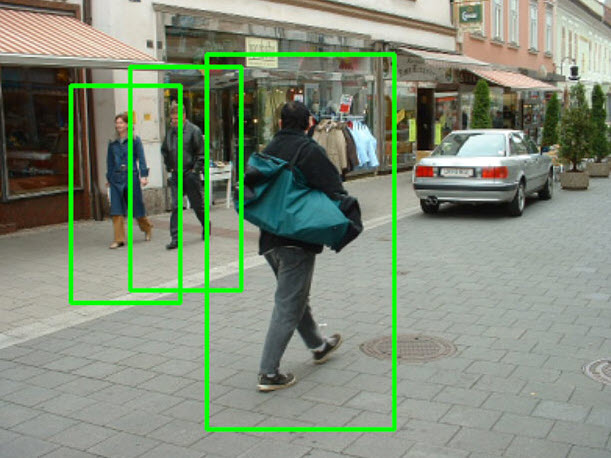
    </div>
    We will practice training model human detection base on HOG.
  
* **Face detection**: HOG is a good algorithm on this problem. It has the ability to represent the main contours of the face based on the direction and gradient magnitude through vectors for each cell as shown bellow <div style="text-align: center;">
   	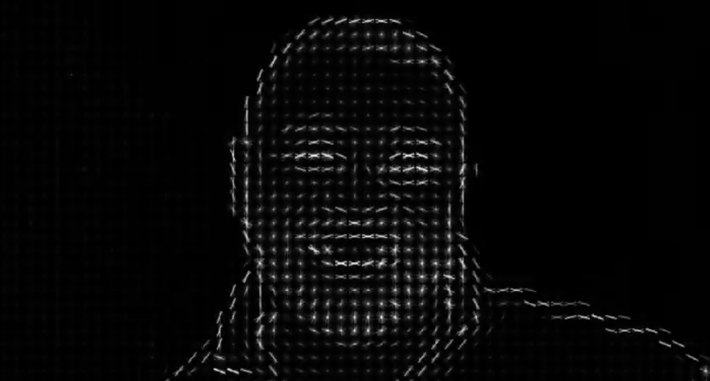
   </div>
  
* **Recognizing Various Objects:** In addition, there are many cases of object recognition in static images, such as vehicles, traffic signals, animals, or even moving images extracted from videos.
* **Creating Features for Image Classification Tasks:** Many image classification tasks are built on small-sized datasets, where using deep learning networks may not always be effective and can lead to overfitting. The reason is that a small amount of data is often insufficient for training a model to accurately recognize object features. In such cases, using HOG (Histogram of Oriented Gradients) for feature extraction can yield better results. Specifically, I will also demonstrate an example at the end.

## Terminology

Before diving into the HOG algorithm, I will first explain the terms used:

* **Feature Descriptor:** A feature descriptor is a representation of an image or an image patch that simplifies the image by extracting useful information and throwing away extraneous information.

* **Histogram:** A histogram is a graphical representation of the distribution of color intensities across different value ranges.

* **Gradient:** The derivative or vector of color intensity changes that helps detect movement directions of objects in an image.

* **Local cell:** A local cell is a small region in an image. In the HOG algorithm, an image is divided into multiple cells based on a square grid. Each cell is called a local cell.

* **Local portion:** A local region is a section of the image where feature extraction is performed. In the algorithm, this local region is referred to as a "block."

* **Local normalization:** Normalization is performed within a local region. It is usually divided by either L2 norm or L1 norm. The purpose of normalization is to standardize color intensity values, making the distribution more consistent. This will be explained in more detail in the algorithm section.

* **Gradient direction:** The gradient direction represents the angle between the gradient vector components $x$ and $y$, which helps determine the direction of intensity change or, in other words, the direction of shading in the image. Given that $G_x$​ and $G_y$​ are the gradient values along the $x$ and $y$ axes of the image, the gradient direction is calculated as:
  
  $$\theta = \arctan\left(\frac{G_y}{G_x}\right)$$

* **Gradient magnitude:** The magnitude of the gradient represents the length of the vector combining the gradients along the $x$ and $y$ directions. The histogram representation of this vector is used to describe the HOG features. The gradient magnitude is computed as:
  
  $$∣G∣=\sqrt{G_x^2+G_y^2}$$​

## Definition

The key point in the working principle of HOG is that the local shape of an object can be described using two matrices: the **gradient magnitude matrix** and the **gradient direction matrix**.
First, the image is divided into a **grid of square cells**, where many adjacent or overlapping **local regions** are identified. These regions are similar to the **local image regions** used in convolutional operations in CNNs.

* A **local region** consists of multiple **local cells** (in HOG, there are **4 cells**) with a size of **8×8 pixels**.
* Then, a **histogram of gradient magnitudes** is computed for each **local cell**.
* The **HOG descriptor** is formed by **concatenating** the four histogram vectors corresponding to each cell into a single combined vector.
* To improve accuracy, each value in the **histogram vector of a local region** is **normalized** using either **L2-norm** or **L1-norm**.
* This normalization aims to enhance **invariance** to **lighting and shading changes**.

<div style="text-align: center;">
	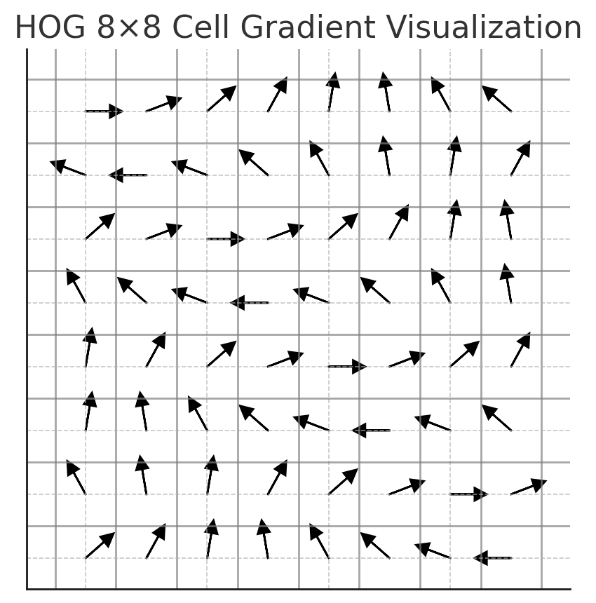
</div>

The HOG descriptor has several key advantages over other feature descriptors:

* Since it operates on **local cells**, it is **invariant** to **geometric transformations** and **brightness changes**.
* Furthermore, as **Dalal and Triggs** discovered, applying **local region normalization** allows the descriptor to ignore minor **body movements** in pedestrian detection, **as long as the person maintains an upright posture**.
* This makes HOG particularly **well-suited for human detection** in images.

## How HOG Works (Step-by-step)

### Step 1: Preprocessing

In every image processing algorithm, the first step is preprocessing image. As mentioned earlier HOG feature descriptor used for pedestrian detection is calculated on a $64×128$ patch of an image. Of course, an image may be of any size. Typically patches at multiple scales are analyzed at many image locations. The only constraint is that the patches being analyzed have a fixed aspect ratio. In our case, the patches need to have an aspect ratio of $1:2$. For example, they can be $100×200$, $128×256$, or $1000×2000$ but not $101×205$.

<div style="text-align: center;">
	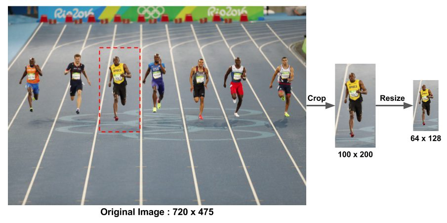
</div>

We need to adjust the image to grayscale

````py
import numpy as np
import cv2
import matplotlib.pyplot as plt

#Read the image
img = cv2.imread("./img/bolt.jpg") # Load BGR format

if img is None:
    print("Image not loaded. Check the file path and file integrity.")
else:
    # Convert BGR to RGB for proper color display in matplotlib
    img_rgb = cv2.cvtColor(img, cv2.COLOR_BGR2RGB)

    #Convert to grayscale
    gray = cv2.cvtColor(img, cv2.COLOR_BGR2GRAY)
    print(img_rgb.shape)
    print(gray.shape)

    #Show the images
    plt.figure(figsize=(8,6))
    plt.subplot(1,2,1)
    plt.imshow(img_rgb)
    plt.title("Original")
    plt.subplot(1,2,2)
    plt.imshow(gray)
    plt.title("Gray Image")
    plt.show()
````

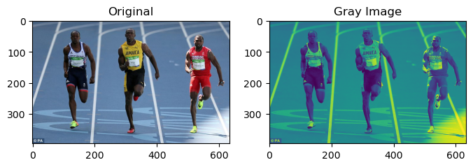

### Step 2: Compute the gradient

To calculate a HOG descriptor, we need to first calculate the horizontal and vertical gradients, the common way to compute is using the **Sobel operator**

* Horizontal gradient
  $$G_x = \begin{bmatrix}
	-1 & 0 & 2 \\
	-2 & 0 & 2 \\ 
	-1 & 0 & 1	
\end{bmatrix}*\textbf{I}$$
* Vertical gradient
  $$G_y = \begin{bmatrix}
		-1 & -2 & -1 \\
		0 & 0 & 0 \\ 
		1 & 2 & 1	
	\end{bmatrix}*\textbf{I}$$
  Where $*$ be a convolution between a filter and an image
* Gradient magnitude
  $$ G=\sqrt{G_x^2+G_y^2}$$
* Gradient direction
  $$\theta=\arctan\Bigl(\frac{G_y}{G_x}\Bigl)$$

````py
#Calculate gradient gx,gy

gx = cv2.Sobel(gray, cv2.CV_32F, dx = 0, dy = 1, ksize=3)

gy = cv2.Sobel(gray, cv2.CV_32F, dx = 1, dy = 0, ksize=3)

  

print('gray shape: {}'.format(gray.shape))

print('gx shape: {}'.format(gx.shape))

print('gy shape: {}'.format(gy.shape))

  

# Compute magnitude and direction gradient

g, theta = cv2.cartToPolar(gx, gy, angleInDegrees=True)

print('gradient format: {}'.format(g.shape))

print('theta format: {}'.format(theta.shape))
````

The output

````
gray shape: (480, 640)
gx shape: (480, 640)
gy shape: (480, 640)
gradient format: (480, 640)
theta format: (480, 640)
````

Visualize the plot

````py
plt.figure(figsize=(20, 10))
plt.subplot(1, 4, 1)
plt.title('gradient of x')
plt.imshow(gx)

plt.subplot(1, 4, 2)
plt.title('gradient of y')
plt.imshow(gy)

plt.subplot(1, 4, 3)
plt.title('Magnitute of gradient')
plt.imshow(g)

plt.subplot(1, 4, 4)
plt.title('Direction of gradient')
plt.imshow(theta)
plt.show()
````

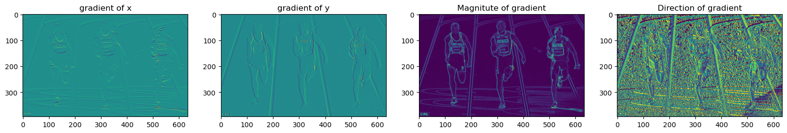

### Step 3: Calculate Histogram of Gradients in $8\times8$ cells

In this step, the image is divided into $8\times8$ cells and a histogram of gradients is calculated for each $8\times8$. One of the important reasons to use a feature description to describe a patch of an image is that it provided a compact representation. An $8\times8$ patch contain $8\times8\times3=192$ pixels. The gradient of this patch contains $2$ values (magnitude and direction) per pixel which adds up to $8\times8\times2 = 128$ numbers include $64$ values of gradient magnitude and $64$ values of gradient direction.
By the end of this section we will see how these $128$ numbers are represented using a **9-bin histogram** which can be stored as an array of $9$ numbers. Not only is the representation more compact, calculating a histogram over a patch makes this representation more robust to noise. Individual gradients may have noise, but a histogram over $8\times8$ patch makes the representation much less sensitive to noise.

But why $8\times8$ patch ? Why not $32\times32$ ? It is a design choice informed by the scale of features we are looking for. HOG was used for pedestrian detection initially. $8\times8$ cells in a photo of a pedestrian scaled to $64\times128$ are big enough to capture interesting features ( e.g. the face, the top of the head etc.).
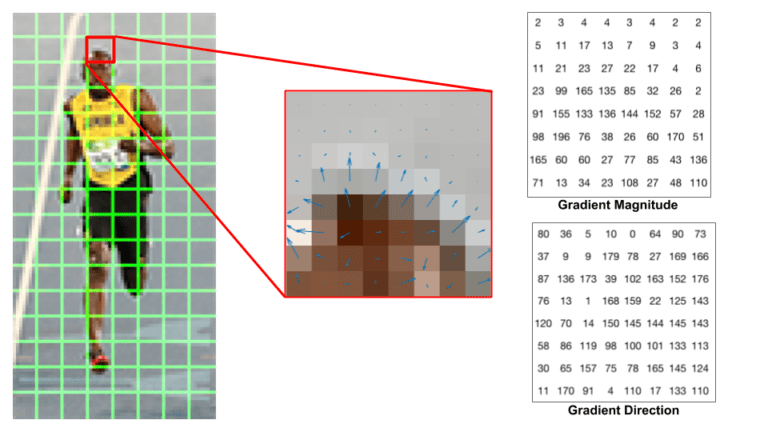
On the right, we see the raw numbers representing the gradients in the 8×8 cells with one minor difference — the angles are between $0$ and $180$ degrees instead of $0$ to $360$ degrees. These are called **“unsigned” gradients** because a gradient and it’s negative are represented by the same numbers. In other words, a gradient arrow and the one $180$ degrees opposite to it are considered the same. But, why not use the $0$ – $360$ degrees ?

Empirically it has been shown that unsigned gradients work better than signed gradients for pedestrian detection. Some implementations of HOG will allow you to specify if you want to use signed gradients.

The next step is to create a histogram of gradients in these $8\times8$ cells. The histogram contains 9 bins corresponding to angles $0, 20, 40 … 160$. The following figure illustrates the process. We are looking at magnitude and direction of the gradient of the same $8\times8$ patch as in the previous figure.
A bin is selected based on the direction, and the vote (the value that goes into the bin) is selected based on the magnitude. Let’s first focus on the pixel encircled in blue. It has an angle (direction) of $80$ degrees and magnitude of $2$. So it adds $2$ to the $5^{th}$ bin. The gradient at the pixel encircled using red has an angle of $10$ degrees and magnitude of $4$. Since $10$ degrees is half way between $0$ and $20$, the vote by the pixel splits evenly into the two bins.

<div style="text-align: center;">
	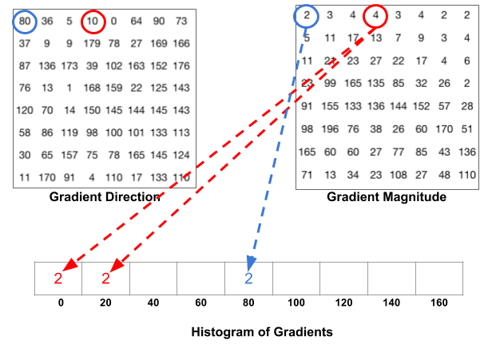
</div>

The approach when gradient direction doesn't fall in any bin(like an example 10 degrees), we will use linear interpolation to divided the gradients to 2 continuous bins which gradient direction falls. Obviously, the gradient direction equal $x$ map to the gradient magnitude $y$, where $x \in [x_0,x_1]$. It's will fall to a point between $(l-1)$ bin and $l$ bin. So that we write
$$ x_{l-1}=\frac{x_1-x}{x_1-x_0}*y,  x_{l}=\frac{x-x_0}{x_1-x_0}*y  $$

<div style="text-align: center;">
	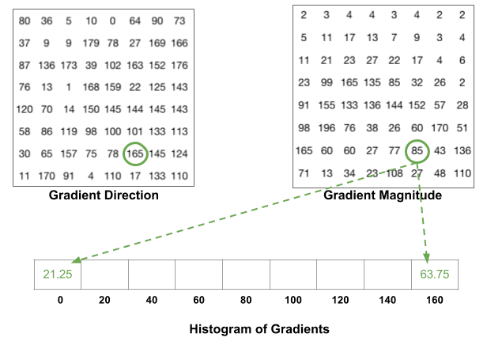
</div>

Take a sum of each gradient magnitude belong in one bins from vector bins and we collect **Histogram of Gradient**

<div style="text-align: center;">
	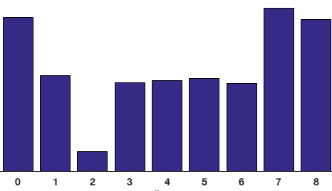
</div>

### Step 4: 16×16 Block Normalization

In the previous step, we created a histogram based on the gradient of the image. Gradients of an image are sensitive to overall lighting. If you make the image darker by dividing all pixel values by 2, the gradient magnitude will change by half, and therefore the histogram values will change by half.

Ideally, we want our descriptor to be independent of lighting variations. In other words, we would like to “normalize” the histogram so they are not affected by lighting variations.

Let's say we have an RGB color vector $[128, 64, 32]$. This length of this vector is $\sqrt{128^2+64^2+32^2}\approx 146.64$. This is call L2 norm. Dividing each element of this vector give us a normalized vector $[0.87,0.43,0.22]$

Now consider another vector in which the elements are twice the value of the first vector $2 \times [ 128, 64, 32 ] = [ 256, 128, 64 ]$. You can work it out yourself to see that normalizing $[ 256, 128, 64 ]$ will result in $[0.87, 0.43, 0.22]$, which is the same as the normalized version of the original RGB vector. You can see that normalizing a vector removes the scale.

<div style="text-align: center;">
	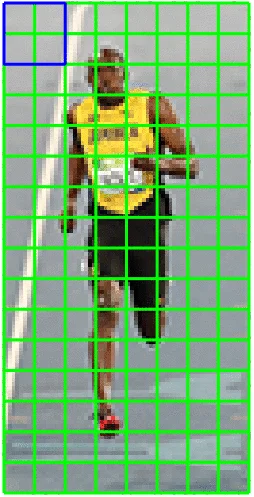
</div>

The normalization will be processed in a block size $2\times 2$ cell (each cell size $8\times8$ pixel). So we will have 4 vector histogram size $1\times9$, concatenate vectors and we will have one vector histogram size $1\times36$ and then normalized in this vector. Sliding the window will process the same as convolution in CNN with step_size = 8 pixels.

### Step 5: Compute HOG features vector

After normalizing the histogram vectors, we then concatenate these $1×36$ vectors into a single large vector. This becomes the HOG vector representing the entire image.

For example, suppose our image is divided into a grid of squares of size $16×8$ (each cell is $8×8$). The HOG computation moves $7$ steps horizontally and $15$ steps vertically. Thus, there are a total of $7×15 = 105$ patches, each corresponding to one $36$-dimensional histogram vector. Consequently, the final HOG vector will have $105×36 = 3780$ dimensions. This is a relatively large vector, which allows it to capture the image’s features quite effectively.

## Visualizing Histogram of Oriented Gradients

The HOG descriptor of an image patch is usually visualized by plotting the 9×1 normalized histograms in the 8×8 cells. See image on the side. You will notice that dominant direction of the histogram captures the shape of the person, especially around the torso and legs.

<div style="text-align: center;">
		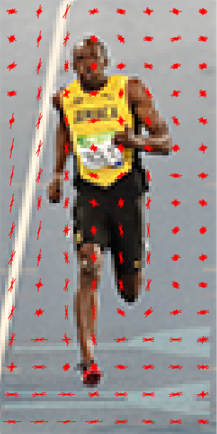
</div>

