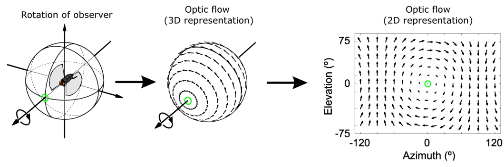
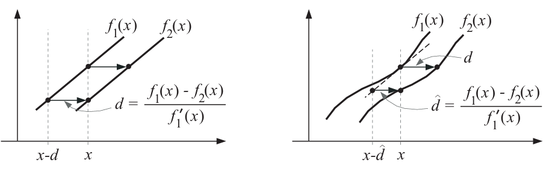

Optical flow quantifies the motion of objects between consecutive frames captured by a camera. These algorithms attempt to capture the apparent motion of brightness patterns in the image. It is an important subfield of computer vision, enabling machines to understand scene dynamics and movement.

# Basic Gradient-Based Estimation

A common starting point for optical flow estimation is to assume that pixel intensities are translated from one frame to next
$$ I(\vec{x},t)=I(\vec{x}+\vec{u},t+1) \tag{1}$$
where $I(\vec{x},t)$ is an image intensity as a function of space $\vec{x}=(x,y)^T$ and time $t$, and $\vec{u}=(u_1,u_2)^T$ is the 2D velocity.
That equation only holds under *brightness constancy* assumption. Of course, *brightness constancy* rarely hold exactly. The underlying assumptions that surface radiance remains fixed from one frame to next. One can fabricate scenes for which this holds, the scene might be constrained to contain only [Lambertian Surface](https://www.azooptics.com/Article.aspx?ArticleID=790) (no specularities), with a distant point source (so that changing the distance to the light source has no effect), no object rotations, and no secondary illumination (shadows or inter-surface reflection). Although this is unrealistic, it is remarkable that the brightness constancy assumption works well in practice.

To derive an estimator for 2D velocity $\vec{u}$, we first consider the 1D case. Let $f_1(x)$ and $f_2(x)$ be 1D signals (images) at two time instants. In the figure above, suppose that $f_2(x)$ is a translated version $f_1(x)$, let $f_2(x)=f_1(x-d)$ where *d* denotes the translation. [A Taylor series expansion](https://tutorial.math.lamar.edu/classes/calcii/taylorseries.aspx) of $f_1(x-d)$ about x is given by
$$
f_1(x-d) = f_1(x) -df'_1(x) + \frac{d^2}{2!}f''_1(x)-...= \sum_{0}^{\infty}\frac{(-d)^n}{n!}f^{(n)} \tag{2}(x)
$$
With this expansion, we can rewrite the difference between two signals at location $x$
$$
f_1(x)-f_2(x) = df_1(x)-O(d^2f''_1) \tag{3}
$$
Ignoring the second- and higher-order terms, we obtain the approximation at $x$
$$
\hat{d}=\frac{f_1(x)-f_2(x)}{f'_1(x)} \tag{4}
$$
The 1D case generalizes straightforwardly to 2D. Assume that the displaced image is well approximated y the first-order Taylor series:
$$ I(\vec{x}+\vec{u},t+1)\approx I(\vec{x},t)+\vec{u}\nabla I(\vec{x},t)+I_t(\vec{x},t)\tag{5}$$
where $\nabla I(\vec{x},t)=(I_x,I_y)$ and $I_t$ is the partial derivative of image $I(\vec{x},t)$ at time $t$. If $I_t>0$, the pixel is getting brighter and $I_t<0$ otherwise, and $\vec{u}=(u_1,u_2)^T$ is the 2D velocity.
Ignoring the high-order Taylor series, substitute with equation $(1)$, we obtain
$$ \vec{u}\nabla I(\vec{x},t)+I_t(\vec{x},t)=0 \tag{6}$$
This equation relates the velocity to the space-time image derivatives at one image location, and is often called the *gradient constraint equation*

# Reference

1. [Video Analysis Algorithms in Computer Vision](https://www.thinkautonomous.ai/blog/computer-vision-from-image-to-video-analysis/)
1. [Thuật toán phân tích video trong thị giác máy tính – VinBigdata Product](https://product.vinbigdata.org/thuat-toan-phan-tich-video-trong-thi-giac-may-tinh/)
1. [Optical Flow Estimation | Papers With Code](https://paperswithcode.com/task/optical-flow-estimation#task-home) (recommend)
