Convolutional Neural Networks are very similar to ordinary Neural Networks, they are made up of neurons that have learnable weights and biases. Each neuron receives some inputs, performs a dot product and optionally follows it with a non-linearity. The whole network still expresses a single differentiable score function: from the raw image pixels on one end to class scores at the other. And they still have a loss function (e.g. SVM/Softmax) on the last (fully-connected) layer and all the tips/tricks we developed for learning regular Neural Networks still apply.

**Note:** You may have knowledge about **ANN** and **Backpropagation** to read this. Some suggested reading links http://cs231n.github.io/optimization-2 and https://cs231n.stanford.edu/handouts/linear-backprop.pdf

## Convolution

### Definition

Convolution is a concept in digital signal processing that **transforms** the input information through the **convolution operation** with **a filter** to yield an output in a form of a new signal. This signal will **reduces the features** that the filter is not concerned and just **keep the main features**. Each filter have their main purpose. There are many convolution n-dimension, I will talk about the **2D convolution** because it is the easiest to visualize and also the most common convolution.

The two-dimensional convolution applied to the **2D input matrix** and the **2D filter matrix**. The convolution of an input matrix $X \in \mathbb{R}^{W\times H \times d}$ with a filter $F \in \mathbb{R}^{w\times h \times d}$ produces an output matrix $Y \in \mathbb{R}^{W\times H}$. The steps are follows:

* **Compute the convolution at the single point**: Position the filter at the top-left corner of the input matrix, resulting in a submatrix $X_{sub}$ whose size matches the filter's dimension. The first value,  $y_{11}$ is the convolution of $X_{sub}$ with $F$, such as
  $$
y_{11} = \sum_{}^{w}\sum_{}^{h}\sum_{}^{d} x_{sub}[i,j,u] \times f[i,j,u]
$$
* **Slide the window:** Next, slide the filter window across the input matrix from left to right, and then from top to bottom, using the specified stride. For each position, compute the corresponding output value. Once you have traversed the entire input, you obtain the complete output matrix $Y$. ([Click this link to futher more information about this technique](https://usaco.guide/gold/sliding-window?lang=cpp))

<div style="text-align: center;">
	
</div>

In a convolutional neural network (CNN), each subsequent layer takes the output from the layer immediately before it. Therefore, to keep the network design manageable, we need to determine the output size for each layer. This means that given the input (matrix) size $(W_1,H_1)$, a filter of size $(F,F)$, and a stride $S$, we can determine the output matrix $(W_2,H_2)$.
Consider the process sliding with size $1\times W_1$

<div style="text-align: center;">
	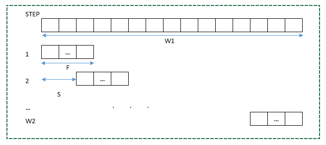
</div>

Assume the process will stop at $W_2$ step. At the first step will reach to position $F$. After each step we will move about $S$, so step $i$ will reach to position $F + (i-1)S$. So that the final step $W_2$ matrix will reach to $F+(W_2-1)S$. This is the highest and closest with $W_1$. In the perfect circumstance the same position $F+(W_2-1)S=W_1$.
$$
W_2=\frac{W_1-F}{S}+1
$$
If there are not in that condition, the division just take the integer, this equation will be
$$
W_2=\lfloor \frac{W_1-F}{S}\rfloor +1
$$
However, we can also make it in the perfect circumstance if we add zero-padding on the both edge bound with size $P$ so that the division will divisible by $S$

<div style="text-align: center;">
	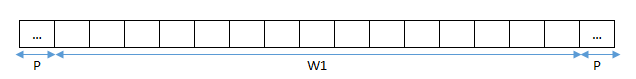
</div>

The equation will be
$$
W_2=\frac{W_1-F+2P}{S}+1
$$
similarly with $H$
$$
H_2=\frac{H_1-F+2P}{S}+1
$$

## Practice

We need to set up such as import lib and load images

````py
import numpy as np
import os
import cv2
from Convolution import conv2d
import matplotlib.pyplot as plt

data_path = "data/"

if not os.path.exists(data_path):
    print(f"Error: Path does not exist - {os.path.abspath(data_path)}")

data_list = os.listdir(data_path)
%load_ext autoreload
%autoreload 2
````

Compute the convolution in 2D

````py
def conv2d(X, F, s=1, p=0):
    """
    X: matrix input
    F: filter
    s: step jump
    p: padding
    """
    (W, H) = X.shape
    f = F.shape[0]
    # Output dimensions
    w = (W - f + 2 * p) // s + 1
    h = (H - f + 2 * p) // s + 1
    X_pad = np.pad(X, pad_width=((p,p),(p,p)), mode='constant', constant_values=0)
    # print(w,h)
    Y = np.zeros((w, h))
    for i in range(w):
        for j in range(h):
            x = i * s
            y = j * s
            Y[i][j] = np.sum(X_pad[x:(x+f),y:(y+f)]*F)
    return Y
````

In this example, I will use emboss filter and calculate the convolution on each image

````py
# emboss filter
filter = np.array([[-2,-1,0]
                   ,[-1,1,1]
                   ,[0,1,2]])

for file in data_list:
    img_path = os.path.join(data_path,file)
    img = cv2.imread(img_path)

    #Convert to grey
    img = cv2.cvtColor(img, cv2.COLOR_RGB2GRAY)
    plt.figure(figsize=(8,6))
    plt.subplot(1,2,1)
    plt.imshow(img)
    #Change to np array
    img = np.array(img)
    blur_img = conv2d(img, filter, s = 1, p=5)
    plt.subplot(1,2,2)
    plt.imshow(blur_img)
    plt.show()
````

## Convolution Neural Network

### Definition

In machine learning, a classifier assigns a class label to a data point. For example, an *image classifier* produces a class label (e.g, bird, plane) for what objects exist within an image. A *convolutional neural network*, or CNN for short, is a type of classifier, which excels at solving this problem!
A CNN is a neural network: an algorithm used to recognize patterns in data. Neural Networks in general are composed of a collection of neurons that are organized in layers, each with their own learnable weights and biases. Let’s break down a CNN into its basic building blocks.

1. A **tensor** can be thought of as an n-dimensional matrix. In CNN above, tensors will be 3-dimensional with the exception of the output layer.
1. A **neuron** can be thought of as a function that takes in multiple inputs and yields as a single output. The outputs of neurons  are represented above as the **activation map**.
1. A **layer** are the collection of the neurons in the same operations
1. **Kernel and weights and bias**, while unique to each neuron, are tuned during the training phase, and allow the classifier to adapt to the problem and dataset provided.
1. A CNN conveys a **differentiable score function**, which is represented as a **class score** in the visualization on the output layers.

Before we start, I will talk some terminology in this blog and you can also see in every lessons or blogs

* **Unit**: A unit represents the value of a specific point in the tensor at each layer of a CNN (Convolutional Neural Network).
* **Receptive Field**: This is a region in the input image that a filter (kernel) processes during convolution. It determines which portion of the input image contributes to a particular unit in the next layer.
* **Local Region**: In a broader sense, it can include the receptive field. It refers to a specific region in the tensor at different layers of a CNN.
* **Feature Map**: This is the output matrix obtained after applying convolution operations between a filter and the receptive fields by sliding from left to right and top to bottom.
* **Activation Map**: The output of the feature map after applying an activation function to introduce non-linearity.

## Architecture view

**Regular Neural Nets**: Neural Networks receive an input (a single vector), and transform it through a series *hidden layer*. Each hidden layer is made up of a set of neurons, where each neuron is fully connected to all neurons in the previous layer, and where neurons in a single layer function completely independently and do not share any connections. The last fully-connected layer is called the “output layer” and in classification settings it represents the class scores.

**Regular Neural Nets** don’t scale well to full images. In CIFAR-10, images are only of size $32\times 32\times 3$ (32 wide, 32 high, 3 color channels), so a single fully-connected neuron in a first hidden layer of a regular Neural Network would have $32\times 32\times 3 =3072$ weights. This amount still seems manageable, but clearly this fully-connected structure does not scale to larger images. For example, an image of more respectable size, e.g. $200 \times 200 \times 3$, would lead to neurons that have $200\times 200\times 3 = 120000$ weights. Moreover, we would almost certainly want to have several such neurons, so the parameters would add up quickly! Clearly, this full connectivity is wasteful and the huge number of parameters would quickly lead to overfitting.
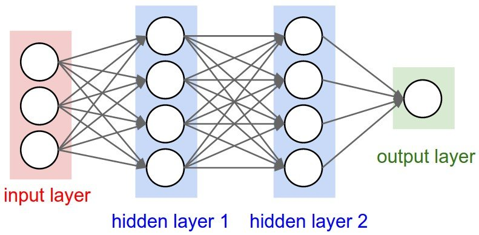

**3D volumes of neurons**. Convolutional Neural Networks take advantage of the fact that the input consists of images and they constrain the architecture in a more sensible way. In particular, unlike a regular Neural Network, the layers of a ConvNet have neurons arranged in 3 dimensions: **width, height, depth**. (Note that the word *depth* here refers to the third dimension of an activation volume, not to the depth of a full Neural Network, which can refer to the total number of layers in a network). For example, the input images in CIFAR-10 are an input volume of activations, and the volume has dimensions $32\times 32\times 3$ (width, height, depth respectively). As we will soon see, the neurons in a layer will only be connected to a small region of the layer before it, instead of all of the neurons in a fully-connected manner. Moreover, the final output layer would for CIFAR-10 have dimensions $1\times 1\times 10$, because by the end of the ConvNet architecture we will reduce the full image into a single vector of class scores, arranged along the depth dimension. In the basic CNN, **depth,stride** and **zero-padding** are the hyperparameters control the output volume.
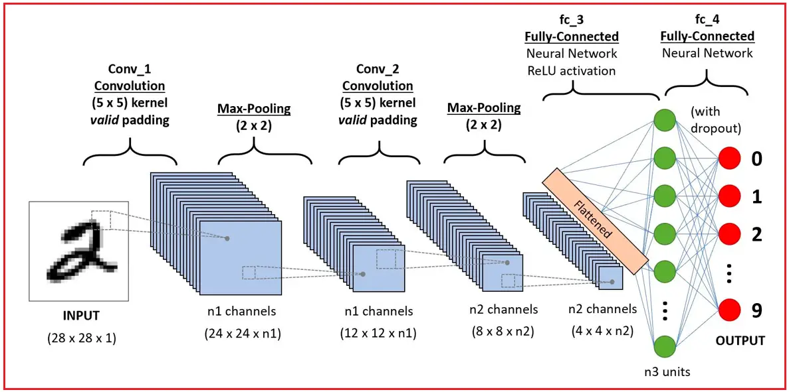

## Layers used to build ConvNets

A simple ConvNet is a sequence of layers, and every layers of a ConvNet transforms one volume of activations to another through a differentiable function. We use three main types of layers to build ConvNet architectures: **Convolutional Layers,Pooling Layer** and **Fully-Connected Layers** (same as the ANN).
We will go into more deeply, but a simple ConvNet for CIFAR-10 classification could have the architecture, INPUT $\rightarrow$ CONV $\rightarrow$ RELU $\rightarrow$ POOL $\rightarrow$ FC

* INPUT 32x32x3 will hold the raw pixel values of the image, in this case an image of width 32, height 32, and three color RGB
* CONV layer will compute the output of neurons that are connected to local regions in the input, each computing a dot product between their weights and a small region they are connected to in the input volume. This may result in volume such as 32x32x12 if we decided to use 12 filters.
* RELU layer will apply an elementwise activation function, such as the $max(0,x)$ thresholding at zero. This leaves the size of the volume unchanged (32x32x12).
* POOL layer will perform a downsampling operation along the spatial dimensions (width, height), resulting in volume such as 16x16x12.
* FC (i.e. fully-connected) layer will compute the class scores, resulting in volume of size 1x1x10, where each of the 10 numbers correspond to a class score, such as among the 10 categories of CIFAR-10. As with ordinary Neural Networks and as the name implies, each neuron in this layer will be connected to all the numbers in the previous volume.
  In this way, ConvNets transform the original image layer by layer from the original pixel values to the final class scores. Note that some layers contain parameters and other don’t. In particular, the CONV/FC layers perform transformations that are a function of not only the activations in the input volume, but also of the parameters (the weights and biases of the neurons). On the other hand, the RELU/POOL layers will implement a fixed function. The parameters in the CONV/FC layers will be trained with gradient descent so that the class scores that the ConvNet computes are consistent with the labels in the training set for each image.
  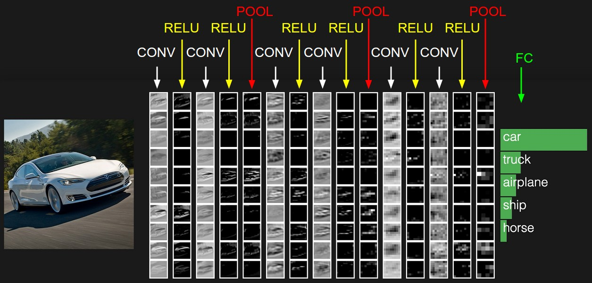

## Convolutional Layer

The Conv layer is the core building block of a Convolutional Network that does most of the computational heavy lifting.
**Let’s first discuss what the CONV layer computes without brain/neuron analogies**. The CONV layer's parameters consist of a set of learnable filters. Every filters is a small spatially(along width and height) but extends through the full depthof the input volume.

<div style="text-align: center;">
	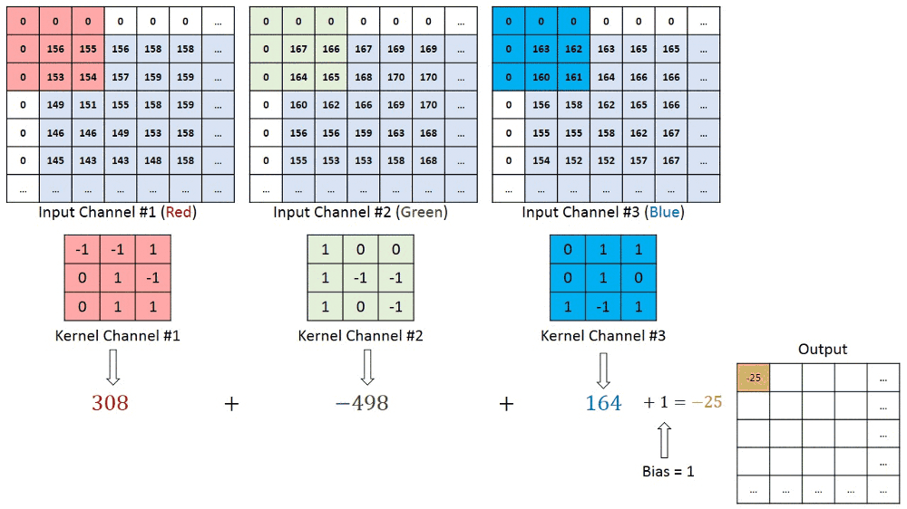
</div>

For example, lets look at the first convolutional layer have $3\times3\times3$ (3 pixels width and height, and 3 color channels), also have padding. During the forward pass, we slide (convolve) each filter across the width and height of the input volume and compute the dot products between entries of filter and the input at any position. As we slide the filter over the width and height of the input volume, we will produce 2-dimensional **activation map** that gives the responses of that filter at every spatial position. Intuitively, the network will learn filters that activate when they see some type of visual features such as an edge of some orientation or a blotch (patch) of some color on the first layer, or eventually entire [honeycomb](https://www.google.com/search?q=honeycomb) on higher layers of the network. Now we will have an entire set of filters in each CONV layer (e.g. 12 filters), and each of them will produce a separated 2-dimensional activation map. We will stack these activation maps along the depth dimension and produce the output volume. Furthermore, every entry in 3D output volume **can also be interpreted an output of a neuron** that look at only a small region in the input and shares the parameters will all neurons to the left and right.

### Local connectivity

When dealing with high-dimensional inputs such as images, as we saw above it is impractical to connect neurons to all neurons in the previous volume. Instead, we will connect each neuron to only a local region of the input volume. The spatial extent of this connectivity is a hyperparameter called the **receptive field** of the neuron (equivalently this is the filter size). The extent of the connectivity along the depth axis is always equal to the depth of the input volume. It is important to emphasize again this asymmetry in how we treat the spatial dimensions (width and height) and the depth dimension: The connections are local in 2D space (along width and height), but always full along the entire depth of the input volume. For example, suppose that the input volume has size $32\times 32\times 3$, (e.g. an RGB CIFAR-10 image). If the receptive field (or the filter size) is $5\times 5$, then each neuron in the Conv Layer will have weights to a $5 \times 5\times 3$ region in the input volume, for a total of $5\times 5\times 75$ weights (and +1 bias parameter). Notice that the extent of the connectivity along the depth axis must be 3, since this is the depth of the input volume.

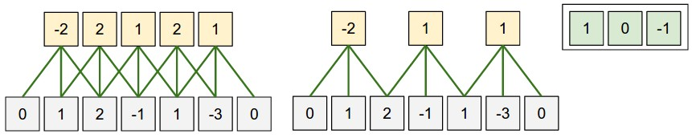

### Zero-Padding

In the figure above on the left, the input dimension was 5 and the output dimension was equal, 5. This worked out because our **receptive field** were 3 and we used zero-padding of 1. If there are no zero-padding used, then the output volume would have spatial dimension only 3. In gereral, setting zero-padding to be $P=(F-1)/2$ when the stride $S=1$ to ensures that the input volume and the output volume have the same size spatially.

## Strides

Note again that the spatial arrangement hyperparameters have mutual constraints. For example, when the input has size $W=10$, no zero-padding is used $P=0$, and the filter size $F=3$, then it possible to use stride $S=2$, since $W_2=(W-F+2P)/S=4.5$, not an integer indicating the neurons don't fit neatly and symmetrically across the input, and a ConvNet library could thrown exception or zero pad the rest to make it fit, or crop the input to make it fit.

### Carefully with choosing

As I mentioned before in the **strides** part. In that example, assume you want to round the $4.5$ to $4$ or $5$ to make the $W_2$ be integer, **that's not a good idea**, when the rounding are applied, this will cause the output shape might not match expectations, can cause misalignment in the **feature map**, when rounded down, some neurons can be missing, when round up, extra neurons will assumed.

### Real-world example

The [Krizhevsky et al.](http://papers.nips.cc/paper/4824-imagenet-classification-with-deep-convolutional-neural-networks) architecture that won the ImageNet challenge in 2012 accepted images of size $227\times 227\times 3$. On the first Convolutional Layer, it used neurons with receptive field size $F=11$, stride $S=4$ and no zero padding $P=0$. Since $(227 - 11)/4 + 1 = 55$, and since the Conv layer had a depth of $K=96$, the Conv layer output volume had size $55\times 55\times 96$. Each of the $55\times 55\times 96$ neurons in this volume was connected to a region of size $11\times 11\times 3$ in the input volume. Moreover, all $96$ neurons in each depth column are connected to the same $11\times 11\times 3$ region of the input, but of course with different weights.

### Parameter Sharing

Parameter sharing scheme is used in Convolutional Layers to control the number of parameters. Using in the the real-world example above, we see that there are $55\times 55 \times 96=290400$ neurons in the first Conv Layer, and each has the $11\times 11\times 3=363$ weight and $1$ bias. Together, this we will have $290400\times 363=105415200$ parameters

## 1x1 Convolution

A **1×1 convolution** applies a **dot product across the depth (channels) of the input feature map**. Instead of capturing spatial relationships (like 3×3 or 5×5 convolutions), it **mixes information across channels**.

Let takes an example: Applying a 1×1 Convolution to a 32×32×3 Image.

* Suppose we have an image of size **32×32×3** (height × width × depth).
* The depth **3** represents the three RGB channels.
* Let's say we apply **N = 5** different **1×1 convolutional filters**.
* Each **1×1 filter** is actually a small matrix of shape **(1×1×3)**—one value for each input channel.

For **each spatial location (x, y)** in the **32×32** grid, the **1×1 filter** performs a **dot product** with the depth (3 channels).

Mathematically, if the input pixel at position $(i, j)$ is:

$$
(i,j) = [R, G, B]
$$

and the 1×1 filter has weights:
$$
\text{Filter} = [w_1, w_2, w_3]
$$
Then the output value at that location is:
$$
\text{Output}(i,j) = R \cdot w_1 + G \cdot w_2 + B \cdot w_3
$$

This operation is repeated for **every** filter, so if we have **5 filters**, we get **5 new feature maps**, meaning the output shape is **32×32×5**.

## Pooling Layer

Pooling layer usually **use between** the convolution layers, which **reduce the spatial size** to reduce an amount of the parameters and computation in the network but still **keep the important features**, and hence **control fitting**.

<div style="text-align: center;">
	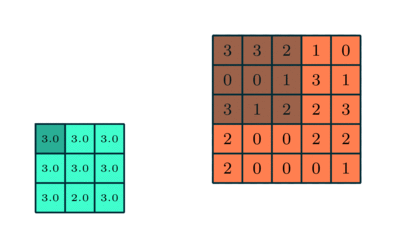
</div>

The Pooling Layer operates independently on every depth slice of the input and resizes it spatially, using the MAX operation. The most common form is a pooling layer with filters of size 2x2 applied with a stride of 2 downsamples every depth slice in the input by 2 along both width and height, discarding 75% of the activations. Every MAX operation would in this case be taking a max over 4 numbers (little 2x2 region in some depth slice). The depth dimension remains unchanged.

<div style="text-align: center;">
	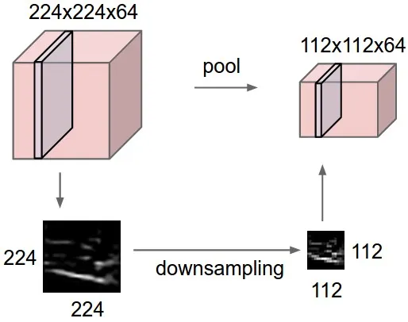
</div>

**General Pooling**.
In addition to max pooling, the pooling units can also perform other functions, such as *average pooling* or even *L2-norm pooling*. Average pooling was often used historically but has recently fallen out of favor compared to the max pooling operation, which has been shown to work better in practice.

## Fully connected layer

After doing convolutional and pooling layer, the model have learn enough features of the image, so the final step is combined it into one. This is called **Fully connected layer**, similarly with ANN, flatten the layer with **tensor** size $H\times W \times D$ with **vector** of size $H\times W \times D$.

<div style="text-align: center;">
	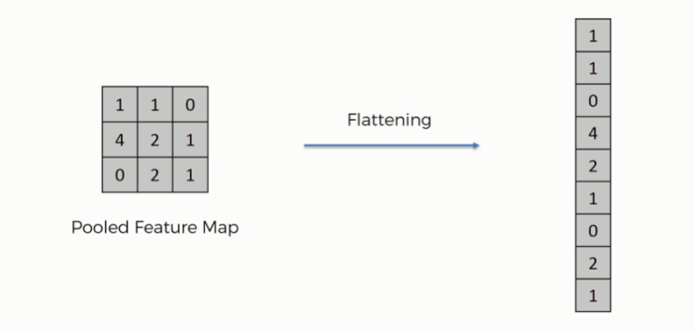
</div>
After that, we use fully connected layer to combine the features to have the output model.

## Layer Sizing Patterns

The **input layer** (image) should be divisible by 2 many times. Common numbers include 32 (CIFAR-10), 64,96 (STL-10) or 224 (ImageNet ConvNets).

The **conv layers** should be using small filter (e.g. 3x3 or at most 5x5), using a stride $S=1$. **Padding (P) with zeros** is applied to maintain the spatial dimensions of the input. For example, for **F = 3 (3×3 filter), use P = 1** to keep the output size the same, for **F = 5 (5×5 filter), use P = 2** to maintain input size. More generally, **P = (F - 1) / 2** ensures the output has the same spatial dimensions as the input.

The **pool layers** are in charge of downsampling the spatial dimensions of the input. The most common setting is to use max-pooling with 2x2 receptive field ($F=2$) and with a stride 2 ($S=2$). Note that this discards exactly 75% of the activations in an input volume. Another slightly less common setting is to use 3x3 receptive fields with a stride of 2, but this makes "fitting" more complicated. It is very uncommon to see receptive field sizes for max pooling that are larger than 3 because the pooling is too lossy and aggressive. This usually leads to worse performance.

*Reducing sizing headaches.* The scheme presented above is pleasing because all the CONV layers preserve the spatial size of their input, while the POOL layers alone are in charge of down-sampling the volumes spatially. In an alternative scheme where we use strides greater than 1 or don’t zero-pad the input in CONV layers, we would have to very carefully keep track of the input volumes throughout the CNN architecture and make sure that all strides and filters “work out”, and that the ConvNet architecture is nicely and symmetrically wired.

*Why use stride of 1 in CONV?* Smaller strides work better in practice. Additionally, as already mentioned stride 1 allows us to leave all spatial down-sampling to the POOL layers, with the CONV layers only transforming the input volume depth-wise.

*Why use padding?* In addition to the aforementioned benefit of keeping the spatial sizes constant after CONV, doing this actually improves performance. If the CONV layers were to not zero-pad the inputs and only perform valid convolutions, then the size of the volumes would reduce by a small amount after each CONV, and the information at the borders would be “washed away” too quickly.

*Compromising based on memory constraints.* In some cases (especially early in the ConvNet architectures), the amount of memory can build up very quickly with the rules of thumb presented above. For example, filtering a 224x224x3 image with three 3x3 CONV layers with 64 filters each and padding 1 would create three activation volumes of size 224x224x64. This amounts to a total of about 10 million activations, or 72MB of memory (per image, for both activations and gradients). Since GPUs are often bottlenecked by memory, it may be necessary to compromise. In practice, people prefer to make the compromise at only the first CONV layer of the network. For example, one compromise might be to use a first CONV layer with filter sizes of 7x7 and stride of 2 (as seen in a ZF net). As another example, an AlexNet uses filter sizes of 11x11 and stride of 4.

## Case studies

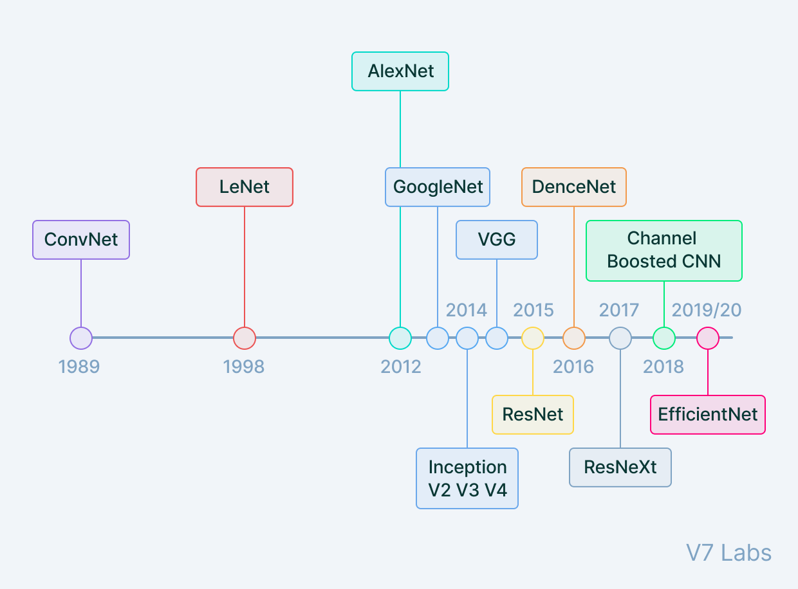

## Reference

1. [CNN Explainer](https://poloclub.github.io/cnn-explainer/)(CNN visualization)
1. [Image Kernels explained visually](https://setosa.io/ev/image-kernels/)(Convolution visualization)
1. [CS231n Convolutional Neural Networks for Visual Recognition](https://cs231n.github.io/convolutional-networks/)
1. [Khoa học dữ liệu](https://phamdinhkhanh.github.io/2019/08/22/convolutional-neural-network.html)
1. [probml.github.io/pml-book/book1.html](https://probml.github.io/pml-book/book1.html)(book)
