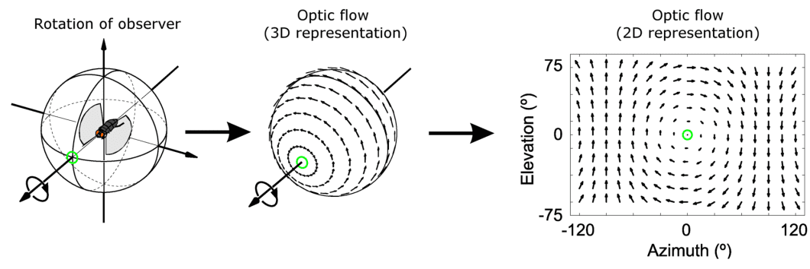
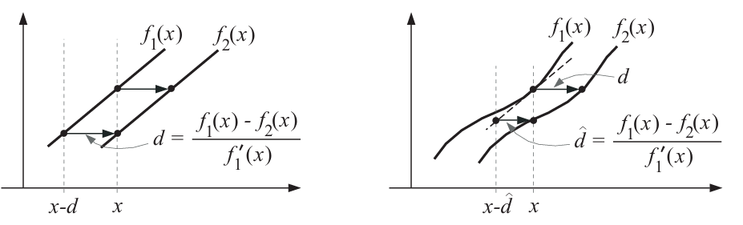
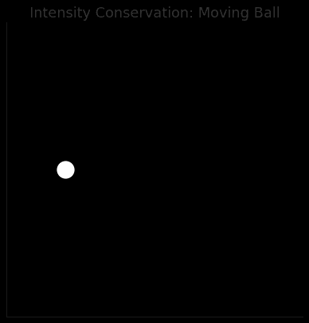

Optical flow quantifies the motion of objects between consecutive frames captured by a camera. These algorithms attempt to capture the apparent motion of brightness patterns in the image. It is an important subfield of computer vision, enabling machines to understand scene dynamics and movement.

## What is brightness

Lets break down the definition of brightness. In an image, **brightness** refers to the intensity of light at each pixel. It determines how **light or dark** a pixel appears.

### How Brightness Is Represented in Images

#### Grayscale Images

* Each pixel has a single intensity value ranging from:
  * **0 (black)**
  * **255 (white)**

#### Color Images (RGB Format)

* Each pixel is made of **Red, Green, and Blue (RGB)** channels.
* Each channel has values from **0 to 255**.
* **Brightness is the combined intensity of all three channels**.

#### How to Measure Brightness?

* **For grayscale images:** Brightness is just the pixel value.
* **For color images:** A common way to measure brightness is:
  $$
brightness = \frac{R+B+G}{3}
$$

## Basic Gradient-Based Estimation

A common starting point for optical flow estimation is to assume that pixel intensities are translated from one frame to next
$$ I(\vec{x},t)=I(\vec{x}+\vec{u},t+1) \tag{1}$$
where $I(\vec{x},t)$ is an image intensity as a function of space $\vec{x}=(x,y)^T$ and time $t$, and $\vec{u}=(u_1,u_2)^T$ is the 2D velocity.
That equation only holds under *brightness constancy* assumption. Of course, *brightness constancy* rarely hold exactly. The underlying assumptions that surface radiance remains fixed from one frame to next. One can fabricate scenes for which this holds, the scene might be constrained to contain only [Lambertian Surface](https://www.azooptics.com/Article.aspx?ArticleID=790) (no secularities), with a distant point source (so that changing the distance to the light source has no effect), no object rotations, and no secondary illumination (shadows or inter-surface reflection). Although this is unrealistic, it is remarkable that the brightness constancy assumption works well in practice.

To derive an estimator for 2D velocity $\vec{u}$, we first consider the 1D case. Let $f_1(x)$ and $f_2(x)$ be 1D signals (images) at two time instants. In the figure above, suppose that $f_2(x)$ is a translated version $f_1(x)$, let $f_2(x)=f_1(x-d)$ where *d* denotes the translation. [A Taylor series expansion](https://tutorial.math.lamar.edu/classes/calcii/taylorseries.aspx) of $f_1(x-d)$ about x is given by

$$
f_1(x-d) = f_1(x) -df'_1(x) + \frac{d^2}{2!}f''_1(x)-...= \sum_{0}^{\infty}\frac{(-d)^n}{n!}f^{(n)} \tag{2}(x)
$$

With this expansion, we can rewrite the difference between two signals at location $x$

$$
f_1(x)-f_2(x) = df_1(x)-O(d^2f''_1) \tag{3}
$$

Ignoring the second- and higher-order terms, we obtain the approximation at $x$

$$
\hat{d}=\frac{f_1(x)-f_2(x)}{f'_1(x)} \tag{4}
$$

The 1D case generalizes straightforwardly to 2D. Assume that the displaced image is well approximated y the first-order Taylor series:

$$ I(\vec{x}+\vec{u},t+1)\approx I(\vec{x},t)+\vec{u}\nabla I(\vec{x},t)+I_t(\vec{x},t)\tag{5}$$

where $\nabla I(\vec{x},t)=(I_x,I_y)$, which $I_x,I_y$ show how brightness changes in the x and y directions and $I_t$ show how brightness changes over time of image $I(\vec{x},t)$ at time $t$. If $I_t>0$, the pixel is getting brighter and $I_t<0$ otherwise, and $\vec{u}=(u_1,u_2)^T$ is the 2D velocity.
Ignoring the high-order Taylor series, substitute with equation $(1)$, we obtain

$$\nabla I(\vec{x},t)\vec{u}+I_t(\vec{x},t)=0 \tag{6}$$
This equation relates the velocity to the space-time image derivatives at one image location, and is often called the *gradient constraint equation* or **Optical flow constraint equation(OFCE)**. If one has access to only two frames, or cannot estimate $I_t$, it is straight-forward to derive a closely related gradient constraint, in which $I_t(\vec{x},t)$ is replaced by $\delta I(\vec{x},t) \triangleq I(\vec{x},t+1)-I(\vec{x},t)$

## Intensity Conversation

	

Imagine you are watching a video where a **white ball moves across a dark background**. As the ball moves, its **brightness (intensity) remains unchanged**, meaning the white color of the ball does not fade or darken while it moves.
Let

* $I(x,y,t)$ represent the brightness (grayscale intensity) at position $(x,y)$ at time $t$.
* The ball moves along a path $\vec{x}=(x(t),y(t))$.
* The intensity of the ball (its brightness) remains constant at $c$.
  From the equation
  $$
I(\vec{x}(t),t)=c \tag{7}
$$
  This means that any time t, the intensity in the track remain the same, regardless of its positions. The temporal derivative of which yields
  $$
\frac{d}{dt}I(\vec{x}(t),t)=0 \tag{8}
$$
  Expanding the left-hand-side, using chain rule give us
  $$
\frac{d}{dt}I(\vec{x}(t),t)=\frac{\partial I}{\partial x}\frac{\partial x}{\partial t} + \frac{\partial I}{\partial y}\frac{\partial y}{\partial t} + \frac{\partial I}{\partial t}\frac{\partial t}{\partial t} = \nabla I(\vec{x},t)\vec{u} + I_t \tag{9}
$$
  where the path derivative it just the optical flow $\vec{u} \triangleq (dx/dt,dy/dt)^T$. Combine $(8),(9)$ we have *gradient constraint equation*.

## Least-Squares Estimation

Once cannot recover u from one gradient constraint since $(6)$ is one equation with two unknown, $u_1$ and $u_2$. The intensity gradient constrains the flow to a one parameter family of velocities along a line in *velocity space*.
Two vectors are perpendicular if their dot product is zero:

$$
\nabla I \cdot \vec{d} = 0
$$

where:

* $\nabla I = (I_x, I_y)$ *(gradient direction)*, and
* $\vec{d}$ is the **direction vector of the constraint line**.

From the equation $I_x \, u + I_y \, v = -I_t$ we can rewrite the direction vector of the line as:
$$
\vec{d} = (I_y, -I_x)
$$
Now, compute the dot product:

$$
(I_x, I_y) \cdot (I_y, -I_x)
= I_x I_y + I_y (-I_x)
= I_x I_y - I_x I_y
= 0
$$
So that the optical flow constraint line is perpendicular to $\nabla I$ and its perpendicular distance from the origins $|I_t|/||\nabla I||$.
One common way to further constrain $\vec{u}$ is to use the gradient constraints, assuming they share the same 2D velocity. With many constraints there may be no velocity that simultaneously satisfies them all, so instead we find the velocity that minimizes the constraint errors. The least-squares (LS) estimator minimizes the squared errors
$$
E(\mathbf{u}) \;=\; \sum_{\vec{x}} g(\vec{x}) 
\Bigl[\;\vec{u} \,\cdot\, \nabla I(\vec{x}, t) \;+\; I_t(\vec{x}, t)\Bigr]^{2}
$$

where $g(\vec{x})$ is a weighting function that determines the *support* of the estimator (the region within which we combine constraints). It is common to let $g(\vec{x})$ be Gaussian in order to weight constraints in the center of the neighborhood more highly, giving them more influence. The 2D velocity $\hat{u}$ that minimizes $E(\vec{u})$ is the least squares flow estimate.
The minimum of $E(\vec{u})$ can be found from its critical points, where its derivatives with respect to $\vec{u}$ are zero; i.e.,

$$
\frac{\partial E(u_1, u_2)}{\partial u_1}=\sum_{\vec{x}} g(\tilde{x})\Bigl[u_1 \,I_x^2+ u_2 \, I_x \, I_y+ I_t \, I_x\Bigr]= 0
$$

$$
\frac{\partial E(u_1, u_2)}{\partial u_2}
=\sum_{\vec{x}} g(\vec{x})\Bigl[u_1 \, I_xI_y + u_2 \, I_y^2+ I_t \, I_y\Bigr]= 0
$$
These equations can we rewritten in matrix form

$$ 
\mathbf{M}\vec{u}=\vec b
$$
Where $\mathbf{M}$ and $\vec{b}$ are
$$
\mathbf{M} = 
\begin{bmatrix}
\sum g I_x^2 & \sum g I_xI_y \\
\sum gI_y^2 & \sum g I_x I_y
\end{bmatrix}
, \vec{b} = -
\begin{pmatrix}
I_tI_x \\
I_tI_y
\end{pmatrix}
$$
When $\mathbf{M}$ has rank 2, then the LS estimate is $\hat{u}=\mathbf{M}^{-1}\vec{b}$

## Find root

Back to the equation **OCFE**, this gives you one equation but find two unknowns $(u,v)$, this means the solution cannot be determined uniquely with a single constraint (a single pixel), We **need more information** to determine the correct motion for each pixel. So there are different methods handle this problem in different ways

### Lucas-Kanade Optical Flow (Local Estimation)

* Finds $(u,v)$ in small patches (instead of a single pixel).
* Assumes motion is  **constant within a small neighborhood**.
* Uses **least-squares optimization** to find $(u,v)$ for the whole patch.

### Horn-Schunck Optical Flow (Global Estimation)

* Finds $(u,v)$ for every pixel across the entire image.
* Uses a **smoothness constraint** so that neighboring pixels have similar motion.
* Solves $(u,v)$ as a global optimization problem.
  [Click this link to see more information](https://www.ipol.im/pub/art/2013/20/article_lr.pdf)and [this](https://www.cs.cmu.edu/~16385/s17/Slides/14.3_OF__HornSchunck.pdf)

### Brox Optical Flow & Deep Learning-Based Methods

* Use **more complex constraints** (e.g., gradient constancy, deep learning models).
* Improve accuracy for **large and complex motions**

## Practice

## Reference

1. [Video Analysis Algorithms in Computer Vision](https://www.thinkautonomous.ai/blog/computer-vision-from-image-to-video-analysis/)
1. [Thuật toán phân tích video trong thị giác máy tính – VinBigdata Product](https://product.vinbigdata.org/thuat-toan-phan-tich-video-trong-thi-giac-may-tinh/)
1. [Optical Flow Estimation | Papers With Code](https://paperswithcode.com/task/optical-flow-estimation#task-home) (recommend)
1. [14.3 OF - HornSchunck](https://www.cs.cmu.edu/~16385/s17/Slides/14.3_OF__HornSchunck.pdf)
