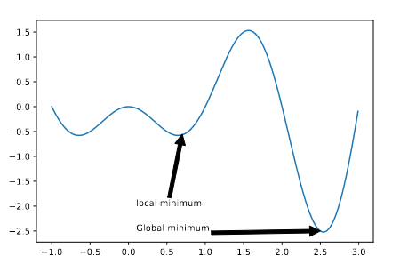
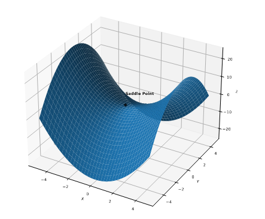
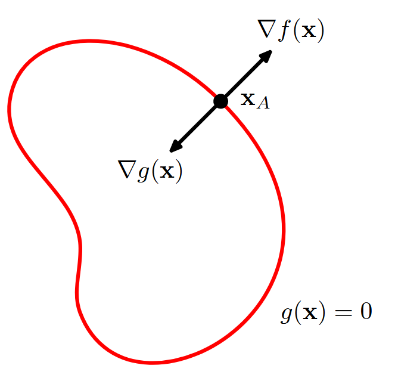
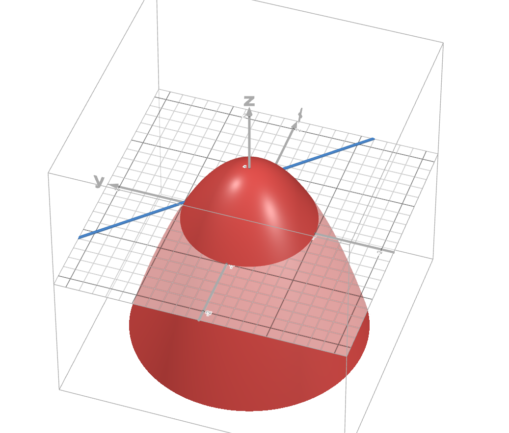
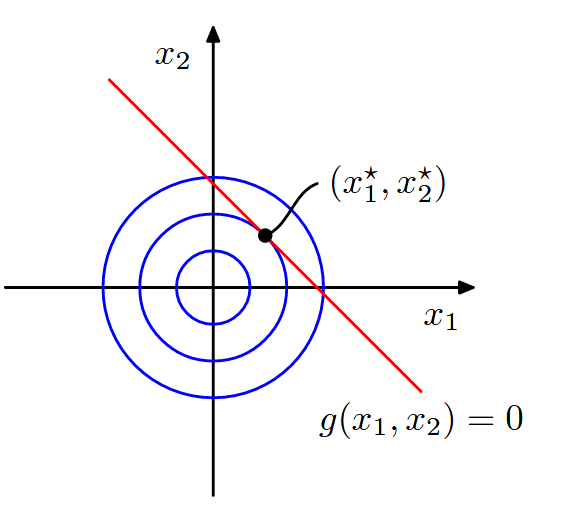

## Introduction

In *Machine Learning*, the core problem is that solving the parameter estimation (model fitting), we want to find the values for a set of variable $\theta\in\Theta$, that minimized the scalar **loss function** or **cost function** $\mathcal{L}(\theta) \rightarrow \mathbb{R}$. This is called a **optimization problem**.
$$
\theta^* \in \arg\min \mathcal{L}(\theta)
$$
We will assume that the *parameter space* is given by $\Theta \subseteq \mathbb{R}^D$, where $D$ is the number of variables being optimized over.

If we want to *maximize* a **score function** $R(\theta)$, we can minimize the loss function $\mathcal{L}(\theta)=-R(\theta)$, we will use this term **objective function** to determine a function we want to minimize or maximize. An algorithm that can find an optimum of an objective function is often called a **solver**.

### Local and Global Optimization

A point satisfies the optimization problem is called a **global optimum**. Finding such a point is called **global optimization**.
In general, finding global optimum is very hard to compute. In such cases we will find the **local optimum**.

	

* A point $x^*$ is called a **local minimum** if:
  $$
\exists \, \varepsilon > 0 \text{ such that } f(x^*) \leq f(x), \quad \forall x \text{ with } \|x - x^*\| < \varepsilon.
$$

* A point $x^*$ is a **local maximum** if:
  $$
\exists \, \varepsilon > 0 \text{ such that } f(x^*) \geq f(x), \quad \forall x \text{ with } \|x - x^*\| < \varepsilon.
$$

### Optimality conditions for local and global optimum

For continuous, twice differentiable functions, we can precisely characterize the points which correspond to local minima. Let $g(\theta) = \nabla\mathcal{L}(\theta)$ be the *gradient vector*, and $H(\theta)=\nabla^2 \mathcal{L}(\theta)$ be the Hessian matrix. Let $g^{}=g({\theta}^{*})$ be the gradient of that point and $H^*=H(\theta^*)$ be the corresponding Hessian. We can show that the following

* Necessary condition: If $\theta^*$ is a local minimum, then $g^*=0$ and $H^*$ must be [positive semi-difinite](https://www.math.purdue.edu/~eremenko/dvi/lect4.9)
* Sufficient condition: If $g^*=0$ and $H^*$ is positive definite, then $\theta^*$ is a local minimum.
  To see why the first condition is necessary, suppose we were at a point $\theta^*$ at which the gradient is non-zero, we could decrease the function by following the negative gradient a small distance, this can make the gradient become zero, but would not be the optimal. Note that the **stationary point** could be local minimum, local maximum or saddle point, which is a point where some directions point downhill, and some uphill. More precisely, at a saddle point, the eigenvalues of the Hessian will be both positive and negative. However, if the Hessian at a point is positive semi-definite, then some directions may point uphill, while others are flat. Moreover, if the Hessian is strictly positive definite, then we are at the bottom of a “bowl”, and all directions point uphill, which is sufficient for this to be a minimum.

	

### Constrained and unconstrained optimization

## Lagrange multipliers

Lagrange multipliers, also sometimes called undermined multipliers, are used to find the stationary points of a function of several variables subject to one or more constraints.
Consider the problem of finding the maximum of a function $f(x_1,x_2)$ subject to a constraint relating $x_1$ and $x_2$, which we write in the form
$$
g(x_1,x_2)=0
$$
One approach would be to solve the constraint equation and thus express $x_2$ as a function of $x_1$ in the form $x_2=h(x_1)$. This can then be substituted into $f(x_1,x_2)$ to give a function of $x_1$ alone of the form $f(x_1, h(x_1))$. The maximum with respect to $x_1$ could then be found by differentiation in the usual way, to give the stationary value $\hat{x}_1$(are found where the gradient is zero), which the corresponding value of $x_2$, $\hat x_2 = h(\hat x_1)$.

One problem with this approach is that it may be difficult to find an analytic solution of the constraint equation that allow $x_2$ to be expressed as an explicit function of $x_1$. Also, this approach treats $x_1$ and $x_2$ differently and so spoils the natural symmetry between these variables, it means that $x_2$ will depend on $x_1$ and make the function asymmetry into the problem that wasn't there originally. The symmetry in here means that the problem treats both variables equally, none of those to be more important than other.  Breaking the symmetry can make the math messier, limit the generality of the solution

A more elegant, and often simpler, approach is have the $\lambda$ called a Lagrange multiplier. We shall motivate this technique from a geometrical perspective. Consider a *D*-dimensional variable $\mathbf{x}$ with the components $x_1,...,x_D$. The constraint equation $g(\mathbf{x})=0$ then represents a (D-1)-dimensional surface in x-space as indicated in this image

	

This is a geometrical picture of the technique of Lagrange multipliers in which we seek to maximize a function $f(\mathbf{x})$, subject to the constraint $g(\mathbf{x})=0$. If $\mathbf{x}$ is _D_-dimensional, the constraint $g(\mathbf{x})=0$ corresponds to a subspace of dimensionality $D-1$. 

We first note that at any point on the constraint surface the gradient $\nabla g(\mathbf{x})$ of the constraint function will be orthogonal to the surface. To see this, consider a point $\mathbf{x}$ that lies on the constraints surface, and consider a nearby point $\mathbf{x} + \epsilon$ that also lies on the surface. If we make a Taylor expansion around $\mathbf{x}$, we have
$$
g(\mathbf{x}+\epsilon) \simeq g(\mathbf{x})+\epsilon^T \nabla g(\mathbf{x})
$$
Because both $\mathbf{x}$ and $\mathbf{x}+\epsilon$ lie on the constraint surface, we have $g(\mathbf{x})=g(\mathbf{x}+\epsilon)$ and hence $\epsilon^T \nabla g(\mathbf{x}) \simeq 0$. In the limit $||\epsilon|| \rightarrow 0$ we have $\epsilon^T \nabla g(\mathbf{x}) = 0$, and because $\epsilon$ is then parallel to the constraint surface $g(\mathbf{x})=0$, we see that the vector $\nabla g$ is normal to the surface.

Next we seek a point $\hat{x}$ on the constraint surface such that $f(\mathbf{x})$ is maximized. Such a point must have the property that the vector $\nabla f(\mathbf{x})$ is also orthogonal to the constraint surface, as illustrated in the figure above, because otherwise, we could increase the value $f(\mathbf{x})$ by moving a short distance along the constraint surface. Thus, $\nabla f$ and $\nabla g$ are parallel (or anti-parallel) vectors, and so there must exist a parameter $\lambda$ such that

$$
\nabla f+\lambda \nabla g=0
$$

where $\lambda \neq 0$ is known as a *Lagrange multiplier*. Note that $\lambda$ can have either sign.
At this point, the *Lagrange function* is defined by

$$
L(\mathbf{x}, \lambda) \equiv f(\mathbf{x}) + \lambda g(\mathbf{x}) 
$$
The constrained stationary condition is obtained by setting $\nabla_\mathbf{x} L = 0$. The condition $\partial L/ \partial\lambda=0$ leads to the constraint equation $g(\mathbf{x})=0$.

Thus, to find the maximum of a function $f(\mathbf{x})$ subject to the constraint $g(\mathbf{x})=0$, we define the Lagrangian with respect to both $\mathbf{x}$ and $\lambda$. For a D-dimensional vector $\mathbf{x}$, this give D+1 equations that determine both the stationary point $\widehat x$ and the value of $\lambda$. If we are only interested in $\widehat x$, then we can eliminate $\lambda$ from the stationary equations without needing to find its value.

	

For example, we suppose to find the stationary point of the function $f(x_1, x_2)= 1-x_1^2-x_2^2$ and the constraint function $g(x_1,x_2)=x_1 + x_2 - 1 = 0$. The corresponding Lagrangian function is given by 
$$
L(\mathbf{x},\lambda)=1-x_1^2-x_2^2 + \lambda(x_1+x_2-1)
$$
The conditions for this Lagrangian to be stationary with respect to $x_1, x_2$ and $\lambda$ give the following equations:

$$
\left\{
\begin{aligned}
-2x_1 + \lambda &= 0 \\
-2x_2 + \lambda &=0 \\
x_1 + x_2 - 1 &= 0
\end{aligned}
\right.
$$

	

Solve these equations and we have $(\hat x_1, \hat x_2) = \left(\frac{1}{2},\frac{1}{2}\right)$ and the Lagrange multiplier is $\lambda=1$.

We can also consider the problem of maximum with *inequality constraint* of the form $g(\mathbf{x})\geq 0$
