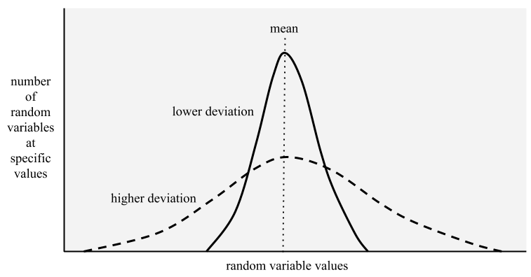

## Introduction

Calling **sample space** ${\mathcal{X}}$ are all possible experiences, and an **event** will be a subset of the sample space.

### Union

$$Pr(A \land B)=Pr(A,B).$$

If independent events,

$$Pr(A \land B)=Pr(A)Pr(B).$$

We say a set of variables ${X_1, \dots, X_n}$ is (mutually) independent if the joint can be written as a product of marginals for all subsets ${\{X_1,\dots, X_m\} \subseteq \{X_1,\dots,X_n\}}$,

$$p(X_1,X_2,\dots,X_n)=\prod_{i=1}^{m}p(X_i).$$

### Disjoint

$$Pr(A \vee B)=Pr(A)+Pr(B)-Pr(A\land B).$$

### Conditional Probability

$$Pr(B|A)\triangleq \frac{Pr(A,B)}{Pr(A)}.$$

If events ${A}$ and ${B}$ are conditionally independent given event ${C}$,

$$Pr(A,B|C)=Pr(A|C)Pr(B|C).$$

Be careful, we say ${X_1, X_2, X_3}$ are mutually independent if the following conditions hold:

$$\begin{split} p(X_1,X_2,X_3)=p(X_1)p(X_2)p(X_3),\\, p(X_1,X_2)=p(X_1)p(X_2),\\, p(X_1,X_3)=p(X_1)p(X_3),\\, p(X_2,X_3)=p(X_2)p(X_3) \end{split}.$$

## Random Variables

Given an experiment with sample space ${\mathbb{S}}$, a random variable (r.v.) is a function mapping from ${\mathbb{S}}$ to ${\mathbb{R}}$.

### Discrete Random Variables

If the sample space ${\mathbb{S}}$ is finite or countable, it is called a discrete r.v. Denote the probability of events in ${\mathbb{S}}$ having value ${x}$ by ${Pr(X=x)}$. This is called the probability mass function (pmf):

$$p(x)\triangleq Pr(X=x).$$

The pmf satisfies ${0\leq p(x) \leq 1}$ and ${\sum_{x\in \mathcal{X}}p(x)=1}$.

### Continuous Random Variables

If ${X \in \mathbb{R}}$, it is called a continuous r.v. The values no longer create a finite set of distinct possible values.

### Cumulative Distribution Function (cdf)

$$P(x) \triangleq Pr(X\leq x).$$

We can compute the probability of any interval:

$$P(a\leq x \leq b) = P(b)-P(a-1).$$

In discrete r.v, the cdf will compute:

$$P(x)=\sum_{x\in \mathcal{X}}p(x).$$

In continuous r.v, the cdf will compute:

$$P(x)=\int_{x\in \mathcal{X}}p(x).$$

### Probability Density Function (pdf)

Define the pdf as the derivative of the cdf:

$$p(x) \triangleq \frac{d}{dx}P(x).$$

As the size of the interval gets smaller, we can write:

$$ Pr(x < X < x + dx) \approx p(x)dx $$

### Quantiles

If the cdf ${P}$ is monotonically increasing, it has an inverse called the **inverse cdf**. If ${P}$ is the cdf of ${X}$, then ${P^{-1}(q)}$ is the value ${x_q}$ such that ${Pr(X\leq x_q)=q}$; this is called the q'th quantile of ${P}$.

### Sets of Related Random Variables

Suppose we have two r.v. ${X}$ and ${Y}$. We can define the joint distribution:

$$p(x,y)=Pr(X=x,Y=y),$$

for all possible values of ${x}$ and ${y}$. We can represent all possible values by a 2D table. For example:

$$\begin{array}{c|cc} p(X,Y) & Y = 0 & Y = 1 \\ \hline X = 0 & 0.2 & 0.3 \\ X = 1 & 0.3 & 0.2 \end{array}.$$

Here, ${Pr(X=0,Y=1)=0.3}$, and

$$\sum_{x \in \mathcal{X},y \in \mathcal{Y}}p(x,y)=1.$$

### Moments of a Distribution

The **mean** (or expected value) for a continuous r.v. is defined as:

$$\mathbb{E}[X]=\int_{x\in \mathcal{X}}x\,p(x)dx.$$

For discrete r.v, the mean is:

$$\mathbb{E}[X]=\sum_{x\in \mathcal{X}}x\,p(x).$$

Since the mean is linear, we have the **linearity of expectation**:

$$\mathbb{E}[aX+b]=a\,\mathbb{E}[X]+b.$$

For ${n}$ random variables, the sum of expectations is:

$$\mathbb{E}\Bigl[\sum X_i\Bigr]=\sum \mathbb{E}[X_i].$$

If they are independent, the expectation of the product is:

$$\mathbb{E}\Bigl[\prod X_i\Bigr]=\prod \mathbb{E}[X_i].$$

When dealing with two or more dependent r.v's, we can compute the moment of one given the others:

$$\mathbb{E}[X]=\mathbb{E}_Y\Bigl[\mathbb{E}[X|Y]\Bigr].$$

A similar formula exists for the variance:

$$\mathbb{V}[X]=\mathbb{E}_Y\Bigl[\mathbb{V}[X|Y]\Bigr] +\mathbb{V}_Y\Bigl[\mathbb{E}[X|Y]\Bigr].$$

The **variance** is a measure of how "spread out" the distribution is, denoted as ${\sigma^2}$ and defined as:

$$\mathbb{V}[X] \triangleq \mathbb{E}[(X- \mu)^2] =\int (x-\mu)^2p(x)dx =\mathbb{E}[X^2]-\mu^2.$$

The **standard deviation** is given by:

$$std[X]=\sqrt{\mathbb{V}[X]}=\sigma.$$

Lower deviation means the distribution is closer to the mean; higher deviation means it is further away.

The variance of a shifted and scaled version of a random variable is:

$$\mathbb{V}[aX+b]=a^2\mathbb{V}[X].$$

For ${n}$ independent random variables, the variance of their sum is:

$$\mathbb{V}\Bigl[\sum X_i\Bigr]=\sum \mathbb{V}[X_i].$$

The variance of their product is:

$$\mathbb{V}\Bigl[\prod X_i\Bigr]= \prod\Bigl(\sigma_i^2 + \mu_i^2\Bigr)-\prod \mu_i^2.$$

**Mode of a Distribution**

The **mode** of a distribution is the value with the highest probability mass or density:

$$\mathbf{x^*}= \arg \max_{\mathbf{x}} p(\mathbf{x}).$$

For multimodal distributions, the mode may not be unique.

## Bayes' Rule

### Bayes' Rule, and with Extra Conditioning

$$P({ A=a}|{ B=b})  = \frac{P({ B=a}|{ A=b})P({ A=a})}{P({ B=b})}.$$

$$P({ A=a}|{ B=b}, { C=c}) = \frac{P({ B=b}|{ A=a}, { C=c})P({ A=a} \mid { C=c})}{P({ B=b} \mid { C=c})}.$$

The term ${p(A)}$ represents what we know about the possible values of ${A}$ before observing any data; this is the **prior distribution**. (If ${A}$ has ${K}$ possible values, then ${p(A)}$ is a vector of ${K}$ probabilities summing to ${1}$.) The term ${p(B \mid A = a)}$ represents the distribution over possible outcomes of ${B}$ if ${A = a}$; this is the **observation distribution**. Evaluated at the observed ${b}$, the function ${p(B = b \mid A = a)}$ is called the **likelihood**.

Multiplying the prior ${p(A = a)}$ by the likelihood ${p(B = b \mid A = a)}$ for each ${a}$ gives the unnormalized joint distribution ${p(A = a, B = b)}$. Normalizing by dividing by ${p(B = b)}$ (the **marginal likelihood**) gives:

$$p(B = b) = \sum_{a' \in \mathcal{A}} p(A = a') p(B = b \mid A = a') = \sum_{a' \in \mathcal{A}} p(A = a', B = b).$$

**Odds Form of Bayes' Rule**

$$\frac{P({ A}| { B})}{P({ A^c}| { B})} = \frac{P({ B}|{ A})}{P({ B}| { A^c})}\frac{P({ A})}{P({ A^c})}.$$

The *posterior odds* of ${A}$ equal the *likelihood ratio* times the *prior odds*.

## Bernoulli and Binomial Distributions

For an experiment tossing a coin with head probability ${0\leq\theta \leq 1}$, let ${Y = 1}$ denote heads and ${Y = 0}$ denote tails. So, ${p(Y=1)=\theta}$ and ${p(Y=0)=1-\theta}$. This is the **Bernoulli distribution**, written as:

$$Y \sim Ber(\theta).$$

The pmf is defined as:

$$\text{Ber}(y \mid \theta) = \begin{cases} 1 - \theta & \text{if } y = 0, \\ \theta & \text{if } y = 1 \end{cases}.$$

It can also be written as:

$$\text{Ber}(y \mid \theta) \triangleq \theta^y(1-\theta)^{1-y}.$$

A Bernoulli trial is a special case of the **Binomial distribution**. Tossing a coin ${N}$ times gives a set of ${N}$ Bernoulli trials, denoted ${y_n \sim Ber(\cdot\mid\theta)}$. Let ${s = \sum_{n=1}^{N}\mathbb{I}(y_n = 1)}$ be the number of heads. Then, ${s}$ follows a binomial distribution:

$$Bin(s \mid\theta,N) \triangleq \binom{N}{s}\theta^s(1-\theta)^{N-s}.$$

When predicting a binary variable ${y \in \{0, 1\}}$ given inputs ${x \in X}$, we use a conditional distribution of the form:

$$p(y|\mathbf{x},\theta) = Ber(y\mid f(\mathbf{x};\theta)).$$

To ensure ${0\leq f(\mathbf{x};\theta)\leq1}$, we often write:

$$p(y|\mathbf{x},\theta) = Ber(y\mid \sigma (f(\mathbf{x};\theta))).$$

where ${\sigma(\cdot)}$ is the **sigmoid** (or logistic) function, defined as:

$$\sigma(a) \triangleq \frac{1}{1+e^{-a}}= \frac{e^a}{1 + e^a}.$$

Its inverse is the **logit function**:

$$a = logit(p) =\sigma^{-1}(p) \triangleq \log\frac{p}{1-p}.$$

Thus, the sigmoid transforms a function from ${\mathbb{R}}$ into a probability in ${[0,1]}$, while the logit transforms a probability into a real number.

Some useful properties of these functions:

$$\sigma(x) \triangleq \frac{1}{1 + e^{-x}} = \frac{e^x}{1 + e^x}.$$

$$\frac{d}{dx} \sigma(x) = \sigma(x)(1 - \sigma(x)).$$

$$1 - \sigma(x) = \sigma(-x).$$

$$\sigma_+(x) \triangleq \log(1 + e^x) \triangleq \text{softplus}(x).$$

$$\frac{d}{dx} \sigma_+(x) = \sigma(x).$$

In particular, note an issue often encountered with activation functions: obtaining zero (or near zero) gradient during backpropagation.

When ${x = 0}$:

$$f(0) = \frac{1}{1 + e^0} = \frac{1}{2},$$

$$f'(0) = \frac{1}{2} \cdot \Bigl(1 - \frac{1}{2}\Bigr) = \frac{1}{4} = 0.25.$$

When ${x \gg 0}$ (large positive):

$$f(x) \to 1, \quad f'(x) = 1 \cdot (1 - 1) = 0.$$

**Gradient approaches 0.**

When ${x \ll 0}$ (large negative):

$$f(x) \to 0, \quad f'(x) = 0 \cdot (1 - 0) = 0.$$

**Gradient also approaches 0.**

## Categorical and Multinomial Distributions

For more than 2 classes, the **categorical distribution** represents a distribution over a finite set of labels ${y \in \{1,\dots,C\}}$, generalizing the Bernoulli to ${C > 2}$. Its pmf is:

$$\text{Cat}(y \mid \theta) \triangleq \prod_{c=1}^{C} \theta_c^{\mathbb{I}(y=c)}.$$

In other words, ${p(y=c \mid \theta)=\theta_c}$, where the parameters are constrained so that ${0\leq\theta_c\leq1}$.

By converting ${y}$ into a **one-hot vector** with ${C}$ elements (e.g. for ${C=3}$, the classes are encoded as ${ (1,0,0) }$, ${ (0,1,0) }$, and ${ (0,0,1) }$), we can view a fair 6-sided die with outcomes:

$$y \in \{1, 2, 3, 4, 5, 6\},$$

with each face having equal probability:

$$\theta = \bigl(\tfrac{1}{6}, \tfrac{1}{6}, \tfrac{1}{6}, \tfrac{1}{6}, \tfrac{1}{6}, \tfrac{1}{6}\bigr).$$

If we roll a 3, the one-hot encoding is:

$$(0, 0, 1, 0, 0, 0),$$

and

$$P(y = 3 \mid \theta) = \theta_3 = \tfrac{1}{6}.$$

For a biased die with:

$$\theta = (0.10, 0.15, 0.30, 0.20, 0.15, 0.10),$$

the probability of rolling a 3 becomes:

$$P(y = 3 \mid \theta) = \theta_3 = 0.30.$$

The categorical distribution is a special case of the **multinomial distribution**. If we observe ${N}$ categorical trials, ${y_n \sim Cat(\cdot\mid\theta)}$ for ${n = 1,\dots,N}$, and define ${y_c = \sum_{n=1}^{N}\mathbb{I}(y_n = c)}$, then the vector ${\mathbf{y}}$ follows:

$$\mathcal{M}(\mathbf{y} \mid N, \theta) \triangleq \binom{N}{y_1 \dots y_C} \prod_{c=1}^{C} \theta_c^{y_c}.$$

In the conditional case, we can define:

$$p(y \mid x, \theta) = \text{Cat}(y \mid f(x; \theta)),$$

or equivalently:

$$p(y \mid x, \theta) = \mathcal{M}(y \mid 1, f(x; \theta)),$$

requiring that ${0 \leq f_c(x; \theta) \leq 1}$ and ${\sum_{c=1}^{C} f_c(x; \theta) = 1}$.

To avoid forcing ${f}$ to directly predict a probability vector, it is common to pass its output into the **softmax** function (or **multinomial logit**), defined as:

$$softmax(\mathbf{a})\triangleq \begin{bmatrix} \frac{e^{a_1}}{\sum_{c'=1}^{C}e^{a_{c'}}}, \dots, \frac{e^{a_C}}{\sum_{c'=1}^{C}e^{a_{c'}}} \end{bmatrix}.$$

This converts ${\mathbb{R}^C}$ into a probability vector in ${[0,1]^C}$. One weakness is that if

$$p_c=\frac{e^{a_c}}{Z(\mathbf{a})}=\frac{e^{a_c}}{\sum_{c'=1}^{C}e^{a_{c'}}},$$

for logits ${\mathbf{a}=f(\mathbf{x},\theta)}$, then for extreme values like ${\mathbf{a}=(1000,1000,1000)}$ or ${\mathbf{a}=(-1000,-1000,-1000)}$, numerical issues (overflow or underflow) occur. To avoid this, we use the trick:

$$\log\sum_{c'=1}^{C}e^{a_{c'}} = m +\log\sum_{c'=1}^{C}e^{a_{c'}-m},$$

with ${m=\max_c a_c}$.

Thus, we have:

$$\begin{aligned} p(y=c|\mathbf{x}) &= \frac{\exp(a_c-m)}{\sum_{c'} \exp(a_{c'}-m)} \\ &=e^{a_c-lse(\mathbf{a})}. \end{aligned}$$

The loss for the softmax function is given by:

$$J(\mathbf{W}; \mathbf{x}, \mathbf{y}) = - \sum_{i=1}^{N} \sum_{j=1}^{C} y_{ji} \log (a_{ji}),$$

or equivalently:

$$J(\mathbf{W}; \mathbf{x}, \mathbf{y}) = - \sum_{i=1}^{N} \sum_{j=1}^{C} y_{ji} \log \Bigl( \frac{\exp(\mathbf{W}_j^T \mathbf{x}_i)}{\sum_{k=1}^{C} \exp(\mathbf{W}_k^T \mathbf{x}_i)} \Bigr).$$

For a single data point $({\mathbf{x}_i}, {\mathbf{y}_i})$, the loss is:

$$J_i(\mathbf{W}) \triangleq J(\mathbf{W}; \mathbf{x}_i, \mathbf{y}_i) = - \sum_{j=1}^{C} y_{ji} \log \Bigl( \frac{\exp(\mathbf{W}_j^T \mathbf{x}_i)}{\sum_{k=1}^{C} \exp(\mathbf{W}_k^T \mathbf{x}_i)} \Bigr).$$

Which can be rewritten as:

$$J_i(\mathbf{W}) = - \sum_{j=1}^{C} y_{ji}\,\mathbf{W}_j^T \mathbf{x}_i + \log \Bigl( \sum_{k=1}^{C} \exp(\mathbf{W}_k^T \mathbf{x}_i) \Bigr).$$

The gradient for each column ${j}$ is computed as:

$$\frac{\partial J_i(\mathbf{W})}{\partial \mathbf{W}_j} = - y_{ji}\,\mathbf{x}_i + \frac{\exp(\mathbf{W}_j^T \mathbf{x}_i)\,\mathbf{x}_i}{\sum_{k=1}^{C} \exp(\mathbf{W}_k^T \mathbf{x}_i)}.$$

This simplifies to:

$$\frac{\partial J_i(\mathbf{W})}{\partial \mathbf{W}_j} = \mathbf{x}_i\,(a_{ji} - y_{ji}),$$

or equivalently:

$$\frac{\partial J_i(\mathbf{W})}{\partial \mathbf{W}_j} = \mathbf{x}_i\,e_{ji}, \quad \text{where } e_{ji} = a_{ji} - y_{ji}.$$

Collecting for all columns, we have:

$$\frac{\partial J_i(\mathbf{W})}{\partial \mathbf{W}} = \mathbf{x}_i\,[e_{i1}, e_{i2}, \dots, e_{iC}] = \mathbf{x}_i\,\mathbf{e}_i^T,$$

and thus the full gradient is:

$$\frac{\partial J(\mathbf{W})}{\partial \mathbf{W}} = \sum_{i=1}^{N} \mathbf{x}_i\,\mathbf{e}_i^T = \mathbf{x}\,\mathbf{E}^T,$$

where ${\mathbf{E} = \mathbf{A} - \mathbf{Y}}$. This compact gradient expression is useful for **Batch Gradient Descent**, **Stochastic Gradient Descent (SGD)**, and **Mini-batch Gradient Descent**.

Assuming SGD, the weight matrix ${\mathbf{W}}$ is updated as:

$$\mathbf{W} = \mathbf{W} + \eta\,\mathbf{x}_i\,(y_i - a_i)^T.$$

## Univariate Gaussian (Normal) Distribution

The cdf of the Gaussian is defined by:

$$\phi(y;\mu,\sigma^2)\triangleq\int_{-\infty}^{y}\mathcal{N}(z,\mu,\sigma^2)dz.$$

It can be implemented using:

$$\phi(y;\mu,\sigma^2)=\tfrac{1}{2}\bigl[1+erf\bigl(\tfrac{z}{\sqrt{2}}\bigr)\bigr],$$

where ${z=(y-\mu)/\sigma}$ and the **error function** is defined as:

$$erf(u)\triangleq\frac{2}{\sqrt{\pi}}\int_{0}^{u}e^{-t}dt.$$

The pdf of the Gaussian is given by:

$$\mathcal{N}(y\mid\mu,\sigma^2)=\frac{1}{\sqrt{2\pi\sigma^2}}\,\exp\!\Bigl(-\tfrac{1}{2\sigma^2}(y-\mu)^2\Bigr).$$

The mean of the distribution is:

$$\mathbb{E}[\mathcal{N}(\cdot\mid\mu,\sigma^2)]=\mu,$$

and the standard deviation is:

$$std[\mathcal{N}(\cdot\mid\mu,\sigma^2)]=\sigma.$$

It is common to parameterize the Gaussian as a function of input variables to create a conditional density model of the form:

$$p(y\mid\mathbf{x},\theta)=\mathcal{N}\Bigl(y\mid f_{\mu}(\mathbf{x};\theta),\, f_{\sigma}(\mathbf{x};\theta)^2\Bigr),$$

where ${f_{\mu}(\mathbf{x};\theta)\in \mathbb{R}}$ predicts the mean and ${f_{\sigma}(\mathbf{x};\theta)\in \mathbb{R}_+}$ predicts the variance.

Assuming fixed variance independent of the input (homoscedastic regression) and a linear mean, we have:

$$p(y\mid\mathbf{x},\theta)=\mathcal{N}\Bigl(y\mid \mathbf{W}^T\mathbf{x}+b,\,\sigma^2\Bigr)$$

with ${\theta=(\mathbf{W},b,\sigma^2)}$. If the variance depends on the input (heteroskedastic regression), then:

$$p(y\mid\mathbf{x},\theta)=\mathcal{N}\Bigl(y\mid\mathbf{W}_{\mu}^T\mathbf{x}+b,\sigma_+\bigl(\mathbf{W}_\sigma^T\mathbf{x}\bigr)^2\Bigr)$$

with $$\theta=(\mathbf{W}_\mu,\mathbf{W}_\sigma)$$, and $\sigma_+(x)$ being the softplus function mapping ${\mathbb{R}}$ to ${\mathbb{R}_+}$.

When the variance approaches 0, the Gaussian becomes infinitely narrow:

$$\lim_{\sigma\rightarrow0}\mathcal{N}(y\mid\mu,\sigma^2)\rightarrow\delta(y-\mu),$$

where the Dirac delta function is defined as:

$$\delta(x) = \begin{cases} +\infty & \text{if } x=0, \\ 0 & \text{if } x \neq 0 \end{cases},$$

and similarly,

$$\delta_y(x) = \begin{cases} +\infty & \text{if } x=y, \\ 0 & \text{if } x \neq y \end{cases},$$

with ${\delta_y(x) = \delta(x-y)}$.

## Some Common Other Univariate Distributions

### Student t Distribution

$$\mathcal{T}(y \mid \mu, \sigma^2, \nu) \;\propto\; \Bigl[ 1 + \tfrac{1}{\nu} \Bigl(\tfrac{y - \mu}{\sigma}\Bigr)^2 \Bigr]^{-\tfrac{\nu + 1}{2}}.$$

Its properties include:

$$\text{mean} = \mu,\quad \text{mode} = \mu,\quad \text{var} = \frac{\nu \sigma^2}{\nu - 2},$$

with the mean defined if ${\nu > 1}$ and the variance if ${\nu > 2}$. For ${\nu \gg 5}$, it approaches a Gaussian. A common choice is ${\nu = 4}$.

### Cauchy Distribution

For ${\nu=1}$, the Student t distribution becomes the **Cauchy** (or **Lorentz**) distribution:

$$\mathcal{C}(x\mid\mu,\gamma)=\frac{1}{\pi\,\gamma} \Bigl[1+\Bigl(\tfrac{x-\mu}{\gamma}\Bigr)^2\Bigr]^{-1}.$$

The **Half Cauchy** distribution (with ${\mu=0}$) is defined as:

$$\mathcal{C}_+(x\mid \gamma) \;\triangleq\; \tfrac{2}{\pi\,\gamma} \Bigl[1+\Bigl(\tfrac{x}{\gamma}\Bigr)^2\Bigr]^{-1}.$$

### Laplace Distribution

Also known as the **double-sided exponential** distribution, the Laplace distribution has the pdf:

$$\text{Laplace}(y \mid \mu, b) \;\triangleq\; \frac{1}{2b} \exp\Bigl(-\tfrac{|y-\mu|}{b}\Bigr),$$

with properties:

$$\text{mean} = \mu,\quad \text{mode} = \mu,\quad \text{var} = 2b^2.$$

### Beta Distribution

The **Beta distribution** is supported on the interval ${[0,1]}$ and is defined as:

$$\text{Beta}(x \mid a, b) \;=\; \frac{1}{B(a, b)}\,x^{\,a-1}\,\bigl(1 - x\bigr)^{b-1},$$

where the **beta function** is:

$$B(a, b) \;\triangleq\; \frac{\Gamma(a)\,\Gamma(b)}{\Gamma(a + b)},$$

and the Gamma function is defined as:

$$\Gamma(a) \;\triangleq\; \int_{0}^{\infty} x^{\,a-1}e^{-x}\,dx.$$

For ${a = b = 1}$, this is the uniform distribution. When both ${a}$ and ${b}$ are less than 1, the distribution is bimodal with spikes at ${0}$ and ${1}$; when both are greater than 1, it is unimodal. Its properties include:

$$\text{mean} = \frac{a}{\,a+b\,}, \quad \text{mode} = \frac{a-1}{\,a+b-2\,}, \quad \text{var} = \frac{ab}{(\,a+b\,)^2(\,a+b+1\,)}.$$

## Transformation of Random Variables

Suppose ${\mathbf{x}\sim p()}$ is a random variable, and ${\mathbf{y}=f(\mathbf{x})}$ is a transformation of it. We discuss how to compute ${p(\mathbf{y})}$.

### Discrete Case

For discrete r.v's, the pmf of ${\mathbf{y}}$ is obtained by summing the pmf of all ${\mathbf{x}}$ such that ${f(\mathbf{x})=\mathbf{y}}$:

$$p_{\mathbf{y}}(\mathbf{y})=\sum_{\mathbf{x}:\,f(\mathbf{x})=\mathbf{y}}p_{\mathbf{x}}(\mathbf{x}).$$

For example, if ${f(\mathbf{x})=1}$ when ${\mathbf{x}}$ is even and ${0}$ otherwise, and ${\mathbf{x}}$ is uniformly distributed over ${\{1,2,\dots,10\}}$, then ${p_{\mathbf{y}}(1)=0.5}$ and ${p_{\mathbf{y}}(0)=0.5}$.

### Continuous Case

For continuous r.v's, we work with the cdf:

$$P_{\mathbf{y}}(\mathbf{y})=Pr(Y\leq \mathbf{y}) = Pr\Bigl(f(\mathbf{x}) \leq \mathbf{y}\Bigr)=Pr\Bigl(\mathbf{x} \in \{x \mid f(x) \leq \mathbf{y}\}\Bigr).$$

If ${f}$ is invertible, differentiating the cdf yields the pdf; if not, Monte Carlo approximation may be used.

### Invertible Transformation (Bijections or One-to-One)

For a monotonic (and hence invertible) function, if ${x\sim Uni(0,1)}$ and ${y=f(x)=2x+1}$, then for general ${p_x(x)}$ and any monotonic ${f:\mathbb{R}\rightarrow\mathbb{R}}$, let ${g=f^{-1}}$ with ${y=f(x)}$ and ${x=g(y)}$. Then:

$$P_y(y)=Pr\!\bigl(f(X)\leq y\bigr)=Pr\!\bigl(X\leq f^{-1}(y)\bigr)=P_x\!\bigl(f^{-1}(y)\bigr)=P_x\!\bigl(g(y)\bigr).$$

Differentiating gives:

$$p_y(y) \triangleq \frac{d}{dy}P_y(y)=p_x\!\bigl(g(y)\bigr)\,\Bigl|\frac{dx}{dy}\Bigr|.$$

For multivariate cases, if ${f:\mathbb{R}^n\rightarrow\mathbb{R}^n}$ is invertible with inverse ${g}$, then:

$$p_y(\mathbf{y})=p_x(\mathbf{x})\,\Bigl|\det\Bigl[\mathbf{J}_g(\mathbf{y})\Bigr]\Bigr|,$$

where ${\mathbf{J}_g(\mathbf{y})=\frac{d\mathbf{g}(\mathbf{y})}{\,d\mathbf{y}^T}}$ is the Jacobian.

### Convolution Theorem

For ${Y=X_1+X_2}$ with independent r.v's ${X_1}$ and ${X_2}$, in the discrete case:

$$p(Y=y)=\sum_{x=-\infty}^{\infty}p(X_1=x)\,p(X_2=y-x).$$

In the continuous case:

$$p(y)=\int p_1(x_1)\,p_2(y-x_1)\,dx_1.$$

This is written as:

$$p = p_1 \circledast p_2,$$

where ${\circledast}$ is the **convolution** operator.

### Central Limit Theorem

The Central Limit Theorem states that the sum of ${N}$ independent and identically distributed (i.i.d.) random variables (regardless of their original distribution) will approximate a Gaussian distribution as ${N}$ increases.

### Monte Carlo Approximation

Suppose ${\mathbf{x}}$ is a random variable and ${\mathbf{y}=f(\mathbf{x})}$. When computing ${p(\mathbf{y})}$ directly is difficult, one can approximate it by drawing a large number of samples from ${p(x)}$, computing ${y_s=f(x_s)}$, and forming the empirical distribution:

$$p_{\mathbf{y}}(y) \triangleq \frac{1}{N_s} \,\sum_{s=1}^{N_s} \delta\!\bigl(y - y_s\bigr).$$
